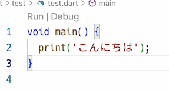

# 組み込み型と変数

## エントリーポイント

最初にプログラムの実行方法について解説します。

プログラムの実行が開始される位置のことを**エントリーポイント**といいます。Javaの場合には`public static void main(String[] args)`メソッドがエントリーポイントでした。Dartは`main`関数がエントリーポイントになります。関数については、後述しますが、`main`の関数を次のように書くとエントリーポイントになります。プログラムを実行するとこの関数から動作します。

例えば、次のプログラムを`test.dart`として作成してください。

<pre>
<code class="language-run-dartpad:theme-light:mode-flutter:ga_id-example1">
void main() {
  print(&#x27;こんにちは&#x27;);
}
</code>
</pre>

??? オフライン用

    ``` dart linenums="1"
    void main() {
      print('こんにちは');
    }
    ```

記述したら、ターミナルを開きます。ターミナルで、`dart test.dart`とすると実行することができます。実行すると画面に`こんにちは`と出てくるはずです。

VSCodeの場合、`main`関数の前に`Run`と出ているので、それをクリックしても実行できます。



`main`は関数です。関数については別途解説しますので、今プログラムを実行して確認したい場合には、`void main()`の後ろの`{}`の間に命令を書いて実行してください。

## 型と変数

### 型の基本

変数は、Javaと同じように型を明示して作成します。例えば、整数の変数`a`を作りたいときには

``` dart
int a;
```

とします。

また、Javaと同様に次のように変数宣言と同時に初期化することもできます。

``` dart
int a = 100;
```

さらに、宣言と同時に初期化し、型が明らかな場合には、Javaと同様に`var`とし型を明示しなくても良いです。

``` dart
var a = 100;
```

### nullの扱い

Javaの場合には`int`や`boolean`等のプリミティブ型（基本型）には`null`を代入することができません。しかし、Dartの場合には`int`や`bool`等はクラス（例えば、[intクラス](https://api.dart.dev/stable/2.19.5/dart-core/int-class.html){target=_blank}）のため、`null`を代入することができます。ただし、`null`を代入する場合には型に`?`を付け`null`を代入することがあるということを明示しないといけません。

例えば、次のように型に`?`を付けずに`null`を代入するとエラーになります。

``` dart
int a = null;
```

変数に`null`を代入したい場合には、型の後ろに`null`を代入するかもしれないという意味で`?`を付けます。

``` dart
int? a = null;
```

`null`が入る可能性がある場合には、必ず`?`を付けなければいけません。逆に、`null`が絶対に入らないのであれば、`?`をつけるべきではありません。

`null`を代入する場合には、型が明確にならないため`var`を使うことはできません。

宣言時に変数を初期化できない場合でも、次のような場合、必ず変数に値が入るため`?`を付ける必要はありません。

<pre>
<code class="language-run-dartpad:theme-light:mode-flutter:ga_id-example1">
void main() {
  int a;
  int b = 3;

  if (b == 3) {
    a = 1;
  } else {
    a = 2;
  }

  print(a);
}
</code>
</pre>

??? オフライン用

    ``` dart linenums="1"
    void main() {
      int a;
      int b = 3;

      if (b == 3) {
        a = 1;
      } else {
        a = 2;
      }

      print(a);
    }
    ```

!!! note "ノート"

    Javaの場合には、参照型の場合には`Optional<T>`、プリミティブ型の場合には`OptionalInt`や`OptionalDouble`等の型を使うことで（少し煩雑ですが）同様のことができます。

#### 練習問題 int-1

変数`x`を`int`型で作成すること（`?`は付けない）。変数の作成と同時に、`x`を`null`で初期化（代入）して、エラーになることを確認すること。

??? 解答例

    ```dart
    void main() {
      int x = null;
    }
    ```

#### 練習問題 int-2

練習問題 int-1のプログラムでエラーが起きないように型を工夫すること。

??? 解答例

    ```dart
    void main() {
      int? x = null;
    }
    ```

## 組み込み型

Dartは、いくつかの型に対して特別な扱いをしています。Javaよりもそれは広範にわたっており、Javaのコレクションクラスにあたる、`List`、`Map`、`Set`等もこれらに含まれています。以下、一つ一つ具体的に確認していきます。

### 数値

数値は、整数のために`int`、小数のために`double`が用意されています。Javaと違い数値はこの2つだけです。

`int`型は符号付き64bit整数で表されるので、-2^63^～2^63^-1（約±900京、1京は1兆の1万倍）までの数を表すことができます。ただし、Webで扱う場合には、JavaScriptの数値となるため、-2^53^～2^53^-1（約±9007兆）までとなります。

`double`型は、[IEEE 754](https://ja.wikipedia.org/wiki/IEEE_754)の浮動小数点として表されます。浮動小数点数のため、次の例のように誤差が出る場合があります。

<pre>
<code class="language-run-dartpad:theme-light:mode-flutter:ga_id-example1">
void main() {
  print(0.1 + 0.2);
}
</code>
</pre>

??? オフライン用

    ```dart
    void main() {
      print(0.1 + 0.2);
    }
    ```

実行すると、次のようになります。このように`double`型の計算では誤差が出ることがありますので、誤差が出ても問題ない場合や、誤差を吸収できるような仕組みを考える必要があります。

```
> dart test.dart
0.30000000000000004
```

整数のリテラルは`0x`をつけると16進数となります。

<pre>
<code class="language-run-dartpad:theme-light:mode-flutter:ga_id-example1">
void main() {
  print(0x1a);
}
</code>
</pre>

??? オフライン用

    ```dart
    void main() {
      print(0x1a);
    }
    ```

数値に関してはJavaと比較すると次のようになります。

| Java | Dart |
|-|-|
| `byte`: 1byte | `int`: 8byte|
| `short`: 2byte | 同上 |
| `int`: 4byte | 同上 |
| `long`: 8byte | 同上 |
| `float`: IEEE754 単精度 | `double`: IEEE754 倍精度 |
| `double`: IEEE754 倍精度 | 同上 |

### 文字列

文字列は`String`型を使います。文字列リテラルは`'`（シングルクォート）か`"`（ダブルクォート）で囲みます。どちらでも構いませんが、Dartのドキュメントではシングルクォートを使っている例が多くあります。そのため、この資料では基本的にシングルクォートで文字列は表します。

文字列は、Javaと同じように見えて違う部分が多くあります。

相違点の1つは文字列の比較です。文字列の比較はJavaと異なり`==`で行えます。

ただ、Javaの`==`と違うわけではなく、Dartの`==`は等値（equality）です。

!!! note "Javaの等価と等値"

    Javaでは`==`は等値（equality）で同じインスタンスかどうかを確認する（プリミティブ型は同じ値かどうかです）演算子です。そのため、2つ`String`のインスタンスを`new`して作成した場合には、同じ文字列を持っている場合でも等値にはなりません。

    `new String("こんにちは")`と2つインスタンスを作り、その文字列が同じかどうかを確認するためには、等価（equivalence）かどうかを確認する必要があります。Javaの場合には等価は`equals`メソッドを使って行います。

文字列リテラルは、`'''`もしくは`"""`で囲むことで、改行を含めることができます。

<pre>
<code class="language-run-dartpad:theme-light:mode-flutter:ga_id-example1">
void main() {
  var s = &#x27;&#x27;&#x27;
  こんにちは
  Dart
  &#x27;&#x27;&#x27;;

  print(&#x27;&gt;$s&lt;&#x27;);
}
</code>
</pre>

??? オフライン用

    ```dart
    void main() {
      var s = '''
      こんにちは
      Dart
      ''';

      print('>$s<');
    }
    ```

実行すると次のようになります。

```
>  こんにちは
  Dart
  <
```

プログラムの7行目で変数`s`の内容を表示していますが、文字列のリテラルの中に`$変数名`もしくは`${変数名}`とすることで、変数の値を埋め込むことができます。

プログラムの実行した結果を見ると、最初の`'''`の行の改行は文字列に含まれませんが、最後の`'''`の前の改行は文字列に含まれています。また、それぞれの行の行頭のスペースも文字列に含まれています。

文字列の中でエスケープシーケンスを無視した、生の文字列を扱いたい場合には、文字列リテラルの先頭に`r`をつけます。

<pre>
<code class="language-run-dartpad:theme-light:mode-flutter:ga_id-example1">
void main() {
  print(r&#x27;Hello \n Dart&#x27;);
}
</code>
</pre>

??? オフライン用

    ```dart
    void main() {
      print(r'Hello \n Dart');
    }
    ```

文字列は`+`で結合することもできますが、文字列同士を隣接させると自動的に結合されます。

<pre>
<code class="language-run-dartpad:theme-light:mode-flutter:ga_id-example1">
void main() {
  const s = &#x27;あいうえお&#x27; &#x27;かきくけこ&#x27; &#x27;さしすせそ&#x27;;
  print(s);
}
</code>
</pre>

??? オフライン用

    ```dart
    void main() {
      const s = 'あいうえお' 'かきくけこ' 'さしすせそ';
      print(s);
    }
    ```

#### 練習問題 string-1

`String`型の変数`html`を作成して、次の文字列を格納すること。見た目通り、改行も含めて変数に入れること。また、最後に`print(html);`として画面にその内容を表示すること。

```
<section>
<p>こんにちは</p>
</section>
```

??? 解答例

    ```dart
    void main() {
      var s = '''
    <section>
    <p>こんにちは</p>
    </section>''';
      print(s);
    }
    ```

#### 練習問題 string-2

変数`name`に`山本`、変数`age`に`19`を入れること。その変数を使って`私は山本です。19歳です`という文字列を`+`を使わずに作成すること。作成した変数を`print`を使って表示すること。

??? 解答例

    ```dart
    void main() {
      var name = '山本';
      var age = 19;
      var s = '私は${name}です。${age}歳です';
      print(s);
    }
    ```

### 真偽値

`true`、`false`の2値を取る真偽値型は`bool`型となります。Javaの`boolean`と変わりません。

### 定数

Dartでも値を変更することができる変数と、値を変更することができない定数があります。定数には`final`と`const`の2つがありますが、ここまで出てきている`int`、`double`、`bool`、`String`では違いはわかりません。

定数は、次のように`final`や`const`をつけることで宣言できます。違いは現段階ではないので、`const`を使っておくといいと思います。また、すぐに初期化する場合には、`int`や`bool`等はつけなくても構いません。

```dart
void main() {
  const i = 3; // intは不要
  const b = true; // boolは不要
  // i = 5; 変更しようとするとエラー
}
```

## 標準入力と型の変換

### 標準入力

キーボードからの入力を受け取りたい場合には、`stdin`を使います。使う場合には`import`が必要です。

```dart
import 'dart:io';
```

その上で、次のようにすることで入力を受け付けることができます。

```dart
var input = stdin.readLineSync();
```

また、`io`ライブラリを使うことで、次の命令も使用できます。

```dart
stdout.write('改行されない');
```

`print`と似ていますが、`write`を使うと引数の文字列を表示のあとに改行されません。

#### 練習問題io-1

キーボードからの入力を受け付ける`stdin.readLineSync`メソッドを使い文字列を取得し、変数`line`に入れること。また、変数`line`の内容を表示すること。

??? 解答例

    ```dart
    import 'dart:io';

    void main() {
      var line = stdin.readLineSync();
      print(line);
    }
    ```

### 型の変換

文字列から`int`型に変換するには、`int`の`parse`メソッドを使います。

```dart
int num = int.parse('123');
```

次のように数値にできない場合には例外が発生します。例外については後述します。

```dart
int num = int.parse('abc');
```

整数と数値は、相互に代入することはできません。

```dart
void main() {
  double d = 1.1;
  int i = d; // エラー
  int i2 = 1;
  double d2 = i2; // エラー
}
```

#### 練習問題1-3-2

キーボードから2つ文字列を入力すること。それぞれ数値に変換し、その合計を画面に表示すること。数値変換時のエラーは無視して良い。

??? 解答例

    ```dart
    import 'dart:io';

    void main() {
      stdout.write('1つ目> ');
      var str1 = stdin.readLineSync();
      stdout.write('2つ目> ');
      var str2 = stdin.readLineSync();
      int num1 = int.parse(str1 ?? '');
      int num2 = int.parse(str2 ?? '');
      print(num1 + num2);
    }
    ```

## リスト、セット、マップ（Javaのコレクションクラス）

### リスト

Dartには配列はなく、順序があるリストが組み込み型として用意されています。型は`List`で、リストの中に入れるデータ型を`<>`の中に書きます。例えば、整数のリストの場合には`List<int>`とします。

リストのリテラルもあり、`[]`の中に`,`区切りで書きます。

```dart
void main() {
  var list1 = [1, 2, 3];
  var list2 = [
    1,
    2,
    3,
  ];
}
```

上記のようにリストの最後の要素の後に`,`を入れるとフォーマッタが要素ごとに改行を入れます。

個別のデータを取ってきたり、データを変更する場合には、`[]`内にインデックス番号を書きます。インデックスはJavaと同じで先頭が0です。

<pre>
<code class="language-run-dartpad:theme-light:mode-flutter:ga_id-example1">
void main() {
  var list = [1, 2, 3];
  print(list);
  print(list[0]);
  list[0] = 99;
  print(list[0]);
}
</code>
</pre>

??? オフライン用

    ```dart
    void main() {
      var list = [1, 2, 3];
      print(list);
      print(list[0]);
      list[0] = 99;
      print(list[0]);
    }
    ```

Javaと同じで、インデックスの範囲外のアクセスはエラーになります。

<pre>
<code class="language-run-dartpad:theme-light:mode-flutter:ga_id-example1">
void main() {
  var list = [1, 2, 3];
  list[3] = 10;
}
</code>
</pre>

??? オフライン用

    ```dart
    void main() {
      var list = [1, 2, 3];
      list[3] = 10;
    }
    ```

実行結果。

```
Unhandled exception:
RangeError (index): Invalid value: Not in inclusive range 0..2: 3
#0      List._setIndexed (dart:core-patch/growable_array.dart:290:49)
#1      List.[]= (dart:core-patch/growable_array.dart:285:5)
#2      main (file:///C:/first/2021/app/file/dart/test.dart:3:7)
#3      _delayEntrypointInvocation.<anonymous closure> (dart:isolate-patch/isolate_patch.dart:297:19)
#4      _RawReceivePortImpl._handleMessage (dart:isolate-patch/isolate_patch.dart:192:12)
```

`List`で定数の`final`と`const`の違いが確認できます。まず、`final`から確認します。`final`は次の例のように、`List`の内容を変更することはできますが、`List`そのものを別のものにすることはできません。

```dart
void main() {
  final list = [1, 2, 3];
  list[0] = 4;
  print(list);
  // list = [4, 5, 6]; エラー
}
```

`const`は`final`と違い内容の変更もできません。

```dart
void main() {
  var list = const [1, 2, 3];
  list[0] = 3; // 実行時にエラー
}
```

リストにはいろいろな方法で、値の追加ができます。

<pre>
<code class="language-run-dartpad:theme-light:mode-flutter:ga_id-example1">
void main() {
  var list1 = [1, 2, 3];
  var list2 = [0, ...list1];

  print(&#x27;list2=${list2}&#x27;);

  var flag = false;
  var list3 = [
    0,
    1,
    if (flag) 3,
  ];
  print(&#x27;list3=${list3}&#x27;);
}
</code>
</pre>

??? オフライン用

    ```dart
    void main() {
      var list1 = [1, 2, 3];
      var list2 = [0, ...list1];

      print('list2=${list2}');

      var flag = false;
      var list3 = [
        0,
        1,
        if (flag) 3,
      ];
      print('list3=${list3}');
    }
    ```

この例の場合、`list2`の最後に`list1`の内容を追加しています。

`list3`は最後に`if`の条件を書き、`true`の場合には値を追加するということをしています。

また、次のように`for`ループの結果をリストに含むということもできます。

<pre>
<code class="language-run-dartpad:theme-light:mode-flutter:ga_id-example1">
void main() {
  var list = [for (var i = 1; i &lt;= 10; i++) i];
  print(&#x27;list=${list}&#x27;);
}
</code>
</pre>

??? オフライン用

    ```dart
    void main() {
      var list = [for (var i = 1; i <= 10; i++) i];
      print('list=${list}');
    }
    ```

`List`の[API](https://api.dart.dev/stable/2.16.2/dart-core/List-class.html)からいくつか使えそうなものを紹介します。

`isEmpty`、`isNotEmpty`では要素が0件か、そうでないかのチェックができます。

<pre>
<code class="language-run-dartpad:theme-light:mode-flutter:ga_id-example1">
void main() {
  var list = [1, 2, 3];
  print(list.isEmpty);
  print(list.isNotEmpty);
}
</code>
</pre>

??? オフライン用

    ```dart
    void main() {
      var list = [1, 2, 3];
      print(list.isEmpty);
      print(list.isNotEmpty);
    }
    ```

`length`で`List`に入っている件数を確認できます。

<pre>
<code class="language-run-dartpad:theme-light:mode-flutter:ga_id-example1">
void main() {
  var list = [1, 2, 3];
  print(list.length);
}
</code>
</pre>

??? オフライン用

    ```dart
    void main() {
      var list = [1, 2, 3];
      print(list.length);
    }
    ```

データの追加は、主に2つです。

- `add`メソッド: 最後に要素を追加
- `insert`メソッド: 指定した位置に、要素を挿入

<pre>
<code class="language-run-dartpad:theme-light:mode-flutter:ga_id-example1">
void main() {
  var list = [1, 2, 3];
  list.add(4);
  list.insert(1, 999);
  print(list);
}
</code>
</pre>

??? オフライン用

    ```dart
    void main() {
      var list = [1, 2, 3];
      list.add(4);
      list.insert(1, 999);
      print(list);
    }
    ```

データの削除は、要素を指定するか、インデックスを指定するかどちらかになります。要素の指定の場合には、複数ある場合には最初の要素になります。

<pre>
<code class="language-run-dartpad:theme-light:mode-flutter:ga_id-example1">
void main() {
  var list = [1, 2, 3, 4, 5, 1, 2];
  list.remove(1);
  print(list);
  list.removeAt(2);
  print(list);
}
</code>
</pre>

??? オフライン用

    ```dart
    void main() {
      var list = [1, 2, 3, 4, 5, 1, 2];
      list.remove(1);
      print(list);
      list.removeAt(2);
      print(list);
    }
    ```

データの検索は次のものを使います。

- `contains`: 要素が含まれているかどうか
- `indexOf`、`lastIndexOf`: 要素がどこに入っているか

<pre>
<code class="language-run-dartpad:theme-light:mode-flutter:ga_id-example1">
void main() {
  var list = [1, 2, 3, 4, 5, 1, 2];
  print(list.contains(3));
  print(list.indexOf(2));
  print(list.lastIndexOf(2));
  print(list.lastIndexOf(7));
}
</code>
</pre>

??? オフライン用

    ```dart
    void main() {
      var list = [1, 2, 3, 4, 5, 1, 2];
      print(list.contains(3));
      print(list.indexOf(2));
      print(list.lastIndexOf(2));
      print(list.lastIndexOf(7));
    }
    ```

#### 練習問題list-1

次のプログラムを書くこと。

<pre>
<code class="language-run-dartpad:theme-light:mode-flutter:ga_id-example1">
void main() {
  var list = [1, 2, 3];
  print(list);
}
</code>
</pre>

??? オフライン用

    ```dart
    void main() {
      var list = [1, 2, 3];
      print(list);
    }
    ```

また、`list`の最後の要素の`3`の直後に`,`を入れてファイルを保存し、要素ごとに改行されることを確認すること。

#### 練習問題list-2

変数`list`に次の要素を含むリストを作成すること。

- 1
- 2
- 3

変数作成後、`list`の最後に`4`を追加すること。

最後に、その要素の内容を表示すること（`print(list)`でよい）。

??? 解答例

    ```dart
    void main() {
      var list = [1, 2, 3];
      list.add(4);
      print(list);
    }
    ```

#### 練習問題list-3

変数`list`に次の要素を含むリストを作成すること。

- 1
- 2
- 3

変数作成後、`list`の（先頭が0番目として）1番目に`99`を挿入すること。

最後に、その要素の内容を表示すること（`print(list)`でよい）。

??? 解答例

    ```dart
    void main() {
      var list = [1, 2, 3];
      list.insert(1, 99);
      print(list);
    }
    ```

### セット

重複せずに、順番が保証されないセットが用意されています。セットは`{}`で値を囲んで作成します。

<pre>
<code class="language-run-dartpad:theme-light:mode-flutter:ga_id-example1">
void main() {
  var set = {&#x27;東京都&#x27;, &#x27;北海道&#x27;, &#x27;沖縄県&#x27;, &#x27;東京都&#x27;, &#x27;東京都&#x27;};

  print(&#x27;set=${set}&#x27;);
}
</code>
</pre>

??? オフライン用

    ```dart
    void main() {
      var set = {'東京都', '北海道', '沖縄県', '東京都', '東京都'};

      print('set=${set}');
    }
    ```

上記のように、作成すると`東京都`は重複しているため1つだけセットされます（上記のようにリテラルでセットを作り、重複しているとエディタで警告が表示されます）。

空の`Set`のリテラルを書く場合は、次のように型を明示します。

<pre>
<code class="language-run-dartpad:theme-light:mode-flutter:ga_id-example1">
void main() {
  var set = &lt;String&gt;{};

  print(&#x27;set=${set}&#x27;);
}
</code>
</pre>

??? オフライン用

    ```dart
    void main() {
      var set = <String>{};

      print('set=${set}');
    }
    ```

基本的なメソッドは次のとおりです。

<pre>
<code class="language-run-dartpad:theme-light:mode-flutter:ga_id-example1">
void main() {
  final set = {&#x27;石川県&#x27;, &#x27;富山県&#x27;, &#x27;福井県&#x27;, &#x27;東京都&#x27;};
  print(&#x27;1: $set&#x27;);
  set.add(&#x27;北海道&#x27;);
  print(&#x27;2: $set&#x27;);
  set.add(&#x27;石川県&#x27;);
  print(&#x27;3: $set&#x27;);
  print(&#x27;石川県? ${set.contains(&quot;石川県&quot;)}&#x27;);
}
</code>
</pre>

??? オフライン用

    ```dart
    void main() {
      final set = {'石川県', '富山県', '福井県', '東京都'};
      print('1: $set');
      set.add('北海道');
      print('2: $set');
      set.add('石川県');
      print('3: $set');
      print('石川県? ${set.contains("石川県")}');
    }
    ```

### マップ

キーと値をセットにしたマップも組み込み型として用意されています。マップはセットと同様にリテラルは`{}`で定義します。`{}`の中では`:`でキーと値を区切ります。

<pre>
<code class="language-run-dartpad:theme-light:mode-flutter:ga_id-example1">
void main() {
  var map = {
    &#x27;長野県&#x27;: &#x27;長野市&#x27;,
    &#x27;北海道&#x27;: &#x27;札幌市&#x27;,
    &#x27;富山県&#x27;: &#x27;富山市&#x27;,
  };

  print(&#x27;富山県の県庁所在地は${map[&quot;富山県&quot;]}&#x27;);
}
</code>
</pre>

??? オフライン用

    ```dart
    void main() {
      var map = {
        '長野県': '長野市',
        '北海道': '札幌市',
        '富山県': '富山市',
      };

      print('富山県の県庁所在地は${map["富山県"]}');
    }
    ```

マップの値の取得は`[]`の中にキーを書くことで行えます。
