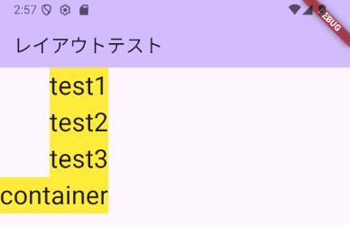
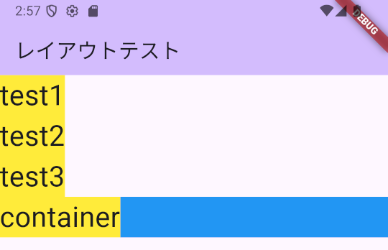

# レイアウト

## アプリケーションの準備

サンプルアプリケーションの内容を削除（必要ならすぐにまた作れます）して、次のコードのみ残します。

これに追記して動きを確認していきます。

```dart
import 'package:flutter/material.dart';

void main() {
  runApp(const MyApp());
}

class MyApp extends StatelessWidget {
  const MyApp({Key? key}) : super(key: key);

  @override
  Widget build(BuildContext context) {
    return MaterialApp(
      title: 'Flutter Demo',
      theme: ThemeData(
        primarySwatch: Colors.blue,
      ),
      home: const LayoutTest(),
    );
  }
}

class LayoutTest extends StatelessWidget {
  const LayoutTest({Key? key}) : super(key: key);

  @override
  Widget build(BuildContext context) {
    return Scaffold(
      appBar: AppBar(
        title: const Text('レイアウトテスト'),
      ),
    );
  }
}
```

## 並べて配置

### Column

Widgetを縦方向に並べたい場合には、`Column`を使います。

`Column`コンストラクタの主な名前付き引数

| 引数 | 説明 |
|-|-|
| `mainAxisAlignment` | 配置方法。`MainAxisAlignment`に`enum`として定義されているものを使う |
| `crossAxisAlignment` | 並べる方向と直行する方向にどのように配置するかを決める。`CrossAxisAlignment`に`enum`として定義されているものを使う |
| `children` | 並べたい`Widget`の`List` |

例えば、次のように作成します。最初の例の`LayoutTest`クラスの`build`メソッドの`Scaffold`コンストラクタの`body`に指定します。

```dart
body: Column(
  children: [
    Text(
      'test1',
      style: Theme.of(context).textTheme.headline4,
    ),
    Text(
      'test2',
      style: Theme.of(context).textTheme.headline4,
    ),
    Text(
      'test3',
      style: Theme.of(context).textTheme.headline4,
    ),
  ],
));
```

このように縦に並びます。


`mainAxisAlignment`には次の値が指定できます。`main`と付いている通り、主となる方向の並べ方のため縦方向にどのように並べるかということになります。

| 指定できる値 | 説明 | 画面 |
|-|-|-|
| `start` | |  |
| `center` | |  |
| `end` | |  |
| `spaceAround` | |  |
| `spaceBetween` | |  |
| `spaceEvenly` | |  |

`crossAxisAlignment`は次のものが使えます。`cross`と付いている通り、主となる方向（縦）と直行する横方向の並べ方の指定になります。

- `baseline`
- `start`
- `center`
- `end`
- `strech`

#### 練習問題

上記の`Column`のサンプルで、`mainAxisAlignment`に6つのパターンすべて入力して確認すること。

??? 解答例

    `start`の例だけ。

    ```dart
    import 'package:flutter/material.dart';

    void main() {
      runApp(const MyApp());
    }

    class MyApp extends StatelessWidget {
      const MyApp({Key? key}) : super(key: key);

      @override
      Widget build(BuildContext context) {
        return MaterialApp(
          title: 'Flutter Demo',
          theme: ThemeData(
            primarySwatch: Colors.blue,
          ),
          home: const LayoutTest(),
        );
      }
    }

    class LayoutTest extends StatelessWidget {
      const LayoutTest({Key? key}) : super(key: key);

      @override
      Widget build(BuildContext context) {
        return Scaffold(
            appBar: AppBar(
              title: const Text('レイアウトテスト'),
            ),
            body: Column(
              mainAxisAlignment: MainAxisAlignment.start,
              children: [
                Text(
                  'test1',
                  style: Theme.of(context).textTheme.headline4,
                ),
                Text(
                  'test2',
                  style: Theme.of(context).textTheme.headline4,
                ),
                Text(
                  'test3',
                  style: Theme.of(context).textTheme.headline4,
                ),
              ],
            ));
      }
    }
    ```

### Row

横に並べるには、`Row`クラスを使います。コンストラクタに指定できる値は`Column`と変わりません。

`mainAxisAlignment`には次の値が指定できます。`Row`の場合には横方向の並べ方になります。

| 指定できる値 | 説明 | 画面 |
|-|-|-|
| `start` | |  |
| `center` | |  |
| `end` | |  |
| `spaceAround` | |  |
| `spaceBetween` | |  |
| `spaceEvenly` | |  |

### Container

`Container`を使うことで、`Widget`に余白を付けたり、色を付けたりすることができます。

`Container`コンストラクタの主な名前付き引数

| 引数 | 説明 |
|-|-|
| `color` | 領域の背景色。`decoration`を指定する場合には、`decoration`の`color`で指定する |
| `width` | `double`型<br>幅 |
| `height` | `double`型<br>高さ |
| `padding` | `EdgeInsetsGeometry`型<br>パディング（設定方法は後述） |
| `margin` | `EdgeInsetsGeometry`型<br>マージン（設定方法は後述） |
| `decoration` | `Container`の装飾 |

パディングとマージンについては、`EdgeInsetsGeometry`を継承した`EdgeInsets`クラスのコンストラクタを使用すると簡単に扱えます。

| コンストラクタ | 説明 |
|-|-|
| `EdgeInsets.all(double value)` | 上下左右すべて同じ`value`の値にします |
| `EdgeInsets.fromLTRB(double left, double right, double top, double bottom)` | 引数で、左、右、上、下の4つの値を指定します |
| `EdgeInsets.only({double left = 0.0, double top = 0.0, double right = 0.0, double bottom = 0.0})` | 名前付き引数で、上下左右の必要な場所の指定をします。指定しない場合には初期値の`0.0`が使われます |

例えば、次のように使います。

```dart
body: Column(
  children: [
    Container(
      child: Text(
        'test1',
        style: Theme.of(context).textTheme.headline4,
      ),
      padding: const EdgeInsets.all(20.0),
      margin: const EdgeInsets.only(bottom: 20.0),
      decoration: const BoxDecoration(
        color: Colors.red,
        border: Border(
          right: BorderSide(
            width: 5.0,
            color: Colors.blue,
          ),
        ),
      ),
    ),
    Text(
      'test2',
      style: Theme.of(context).textTheme.headline4,
    ),
    Text(
      'test3',
      style: Theme.of(context).textTheme.headline4,
    ),
  ],
),
```

`Container`に似たクラスとして次のクラスがあります。`Container`は一通りの指定ができますが、次のクラスは、必要最低限の指定のみとなります。

| クラス | 説明 |
|-|-|
| `Padding` | `padding`のみ指定可能 |
| `SizedBox` | `width`と`height`のみ指定可能 |

`Container`と組み合わせることで、`Column`や`Row`の`crossAxisAlignment`が働きます。

次の`Column`に対して設定して確認します。

```dart
body: Column(
  children: [
    Container(
      width: double.infinity,
      color: Colors.blue[100],
      child: Text(
        'test1',
        style: Theme.of(context).textTheme.headline4,
      ),
    ),
    Container(
      color: Colors.blue[200],
      child: Text(
        'test2',
        style: Theme.of(context).textTheme.headline4,
      ),
    ),
    Container(
      color: Colors.blue[300],
      child: Text(
        'test3',
        style: Theme.of(context).textTheme.headline4,
      ),
    ),
  ],
),
```


| 指定できる値 | 説明 | 画面 |
|-|-|-|
| `baseline` | | |
| `start` | |  |
| `center`  | |  |
| `end` | |  |
| `strech` | |  |

`Container`に対して、`decoration`を設定できます。例えば、下線を引くには次のようにします。

```dart
Container(
  padding: const EdgeInsets.all(20.0),
  decoration: const BoxDecoration(
    border: Border(
      bottom: BorderSide(
        width: 1.0,
        color: Colors.black,
      ),
    ),
  ),
  child: Text('List$i'),
)
```

### Expanded

例えば、次のようなレイアウトにした場合。

```dart
body: Column(
  crossAxisAlignment: CrossAxisAlignment.stretch,
  children: [
    Container(
      color: Colors.blue[200],
      child: Text(
        'text1',
        style: Theme.of(context).textTheme.headline4,
      ),
    ),
    Container(
      color: Colors.red[200],
      child: Text(
        'text2',
        style: Theme.of(context).textTheme.headline4,
      ),
    ),
    Container(
      color: Colors.blue[200],
      child: Text(
        'text3',
        style: Theme.of(context).textTheme.headline4,
      ),
    ),
  ],
),
```

次のような表示になります。


縦方向の余白を埋めたい場合に`Expanded`を使います。例えば、真ん中の赤い部分を引き伸ばす場合は次のように書きます。

```dart
Expanded(
  child: Container(
    color: Colors.red[200],
    child: Text(
      'text2',
      style: Theme.of(context).textTheme.headline4,
    ),
  ),
),
```

そうすると、次のようになります。


余白を分配することもできます。その場合には、`flex`を指定します。

```dart
body: Column(
  crossAxisAlignment: CrossAxisAlignment.stretch,
  children: [
    Container(
      color: Colors.blue[200],
      child: Text(
        'text1',
        style: Theme.of(context).textTheme.headline4,
      ),
    ),
    Expanded(
      flex: 1,
      child: Container(
        color: Colors.red[200],
        child: Text(
          'text2',
          style: Theme.of(context).textTheme.headline4,
        ),
      ),
    ),
    Expanded(
      flex: 2,
      child: Container(
        color: Colors.blue[200],
        child: Text(
          'text3',
          style: Theme.of(context).textTheme.headline4,
        ),
      ),
    ),
  ],
),
```


### BottomNavigationBar

`Scaffold`のコンストラクタの引数に次のものを追加します。

```dart
bottomNavigationBar: BottomNavigationBar(
  items: const <BottomNavigationBarItem>[
    BottomNavigationBarItem(
      icon: Icon(Icons.home),
      label: 'ホーム',
    ),
    BottomNavigationBarItem(
      icon: Icon(Icons.settings),
      label: '設定',
    ),
    BottomNavigationBarItem(
      icon: Icon(Icons.search),
      label: '検索',
    ),
  ],
  currentIndex: 0,
),
```

`BottomNavigationBar`は、次のようにボタンを並べます。


`BottomNavigationBar`コンストラクタの主な名前付き引数

| 引数 | 説明 |
|-|-|
| `items` | `List<BottomNavigationBarItem>`型<br>配置するアイコンのリスト |
| `currentIndex` | `int`型<br>選択済みのアイコンの位置。0〜 |
| `onTap` | `ValueChanged<int>`型<br>タップされたときに呼び出される関数 |

`BottomNavigationBarItem`コンストラクタの主な名前付き引数

| 引数 | 説明 |
|-|-|
| `icon` | `Widget`型<br>表示するアイコン |
| `label` | `String`型<br>アイコンと同時に表示する文字 |

使えるアイコンは、[Iconsクラスのドキュメント](https://api.flutter.dev/flutter/material/Icons-class.html){target=_blank}で確認できます。

#### 選択されているボタンを変更する

選択されているボタンを変更する場合には、`StatefulWidget`で作成する必要があります（ボタンの状態を持たないといけません）。

```dart
import 'package:flutter/material.dart';

void main() {
  runApp(const MyApp());
}

class MyApp extends StatelessWidget {
  const MyApp({Key? key}) : super(key: key);

  @override
  Widget build(BuildContext context) {
    return MaterialApp(
      title: 'Flutter Demo',
      theme: ThemeData(
        primarySwatch: Colors.blue,
      ),
      home: const LayoutTest(),
    );
  }
}

class LayoutTest extends StatefulWidget {
  const LayoutTest({Key? key}) : super(key: key);

  @override
  State<LayoutTest> createState() => _LayoutTestState();
}

class _LayoutTestState extends State<LayoutTest> {
  int _selectedIndex = 0;

  void _onItemTapped(int index) {
    setState(() {
      _selectedIndex = index;
    });
  }

  @override
  Widget build(BuildContext context) {
    return Scaffold(
      appBar: AppBar(
        title: const Text('レイアウトテスト'),
      ),
      bottomNavigationBar: BottomNavigationBar(
        items: const <BottomNavigationBarItem>[
          BottomNavigationBarItem(
            icon: Icon(Icons.home),
            label: 'ホーム',
          ),
          BottomNavigationBarItem(
            icon: Icon(Icons.settings),
            label: '設定',
          ),
          BottomNavigationBarItem(
            icon: Icon(Icons.search),
            label: '検索',
          ),
        ],
        currentIndex: _selectedIndex,
        onTap: _onItemTapped,
      ),
    );
  }
}
```

`BottomNavigationBar`の`onTap`にボタンが押されたときに呼び出される関数を設定します。関数は引数に押したボタンのインデックスが渡されます。

#### 練習問題

上記の`BottomNavigationBar`のサンプルに`BottomNavitaionBarItem`を1つ追加する頃こと。

### FloatingActionButton

次に`FloatingActionButton`を追加します。`BottomNavigationBar`の次に`floatingActionButton`を追加します。

```dart
floatingActionButton: FloatingActionButton(
  onPressed: () {},
  child: const Icon(Icons.plus_one),
),
```

これで、画面の下部に次のように追加されます。


ボタンを押したときに反応がないのは寂しいので、ボタンを押したときの反応を追加します。ボタンを押したときには、`onPressed`で指定した関数が呼び出されます。その関数の中で、`SnackBar`を使いメッセージを表示します。

```dart
onPressed: () {
  ScaffoldMessenger.of(context).showSnackBar(const SnackBar(
    content: Text('ボタンが押されました！'),
  ));
},
```

ボタンを押すと次のように表示され、しばらく待つと消えます。


