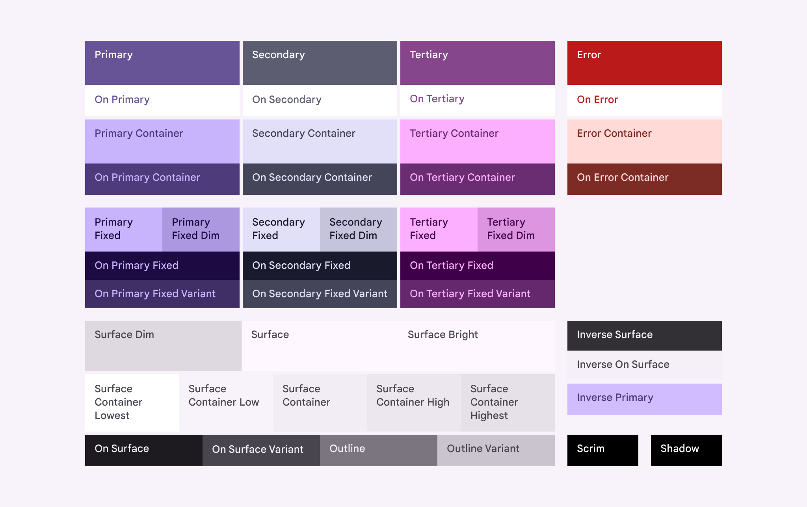
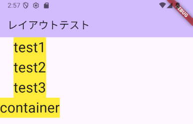

# レイアウト

## 単位

Flutterアプリの中で使われる単位については、論理ピクセルという単位が使われています。

論理ピクセルは、実際のピクセル数ではなく、論理的なピクセルを使うということです。これは同じ大きさの画面であっても、画面の解像度が違う場合があり、その差を吸収するために用いられています。

例えば、iPhone 11とiPhone 16を比較します。

| 機種 | 画面サイズ | 解像度 横 | 解像度 縦 |
|-|-|-|-|
| iPhone 11 | 6.1インチ | 828 | 1792 |
| iPhone 16 | 6.1インチ | 1179 | 2556 |

同じ画面サイズですが、iPhone 16のほうが解像度が高いです。こういった場合に論理ピクセルではなく、物理的なピクセル数でサイズを表すと、機種ごとに大きさの違いが出てしまいます。

例えば、次のように1ピクセルのサイズが異なる2つのスマホがある場合に、物理ピクセルで5ピクセルの長さとなると、このように違った大きさになってしまいます。


このようなスマホごとの画面の解像度を意識しなくていいように、論理ピクセルは使われています。

これは、デバイスピクセル比という数値から計算されています。デバイスピクセル比は、アプリでも確認できますが、[https://krzm.jp/test/](https://krzm.jp/test/){target=_blank}といったサイトで確認するのが簡単です。

例えば、iPhone 15 Proで確認した画面が次のようになっています。


実際の論理ピクセルは、スマートフォンの端末ごとに異なっています。現在発売しているものはおおむね次のサイズのようです。

- 短辺: 360～414px
- 長辺: 640～926px

縦はスクロールすればいいのですが、横幅が入らないのはあまり好ましくありません。横幅は360pxに入るように作る方がいいです。

## アプリケーションの準備

サンプルアプリケーションの内容を削除して、次のコードのみ残します。

これに追記して動きを確認していきます。

``` dart linenums="1" hl_lines="39"
import 'package:flutter/material.dart';

void main() {
  runApp(const MyApp());
}

class MyApp extends StatelessWidget {
  const MyApp({super.key});

  @override
  Widget build(BuildContext context) {
    return MaterialApp(
      title: 'Flutter Demo',
      theme: ThemeData(
        colorScheme: ColorScheme.fromSeed(seedColor: Colors.deepPurple),
      ),
      home: const MyHomePage(title: 'レイアウトテスト'),
    );
  }
}

class MyHomePage extends StatefulWidget {
  const MyHomePage({super.key, required this.title});

  final String title;

  @override
  State<MyHomePage> createState() => _MyHomePageState();
}

class _MyHomePageState extends State<MyHomePage> {
  @override
  Widget build(BuildContext context) {
    return Scaffold(
      appBar: AppBar(
        backgroundColor: Theme.of(context).colorScheme.inversePrimary,
        title: Text(widget.title),
      ),
      body: Column(children: <Widget>[]),
    );
  }
}
```

## テキスト

レイアウトではありませんが、テキストは表示の確認の際にも使うため、最初に確認します。

テキストは`Text`クラスを利用します。引数に指定した文字列を画面に表示します。

``` dart linenums="1"
body: Column(children: <Widget>[Text('こんにちは')]),
```

### 文字の大きさ

文字の大きさはサイズの指定もできますし、見出しの大きさ（Large、Medium、Small）を指定することもできます。

``` dart linenums="1"
body: Column(
  children: <Widget>[
    Text('こんにちは default'),
    Text('こんにちは 20', style: TextStyle(fontSize: 20.0)),
    Text('こんにちは 30', style: TextStyle(fontSize: 30.0)),
    Text('こんにちは 40', style: TextStyle(fontSize: 40.0)),
    Text('こんにちは Large', style: Theme.of(context).textTheme.headlineLarge),
    Text(
      'こんにちは Medium',
      style: Theme.of(context).textTheme.headlineMedium,
    ),
    Text('こんにちは Small', style: Theme.of(context).textTheme.headlineSmall),
  ],
),
```

これは次のような表示になります。


文字の見た目を変更するためには、`Text`の名前付き引数の`style`に`TextStyle`クラスのインスタンスを渡します。以下、`TextStyle`の引数について見ていきます。

### 文字の色

文字の色は、`TextStyle`の`color`に設定します。`color`には`Color`クラスのインスタンスを渡しますが、いろいろな方法で指定ができます。

FlutterはデフォルトでMaterial Design 3で作成されます。それに従った形でデザインをする場合には、色については自分で決めるのではなく、用意されたものから使うのがいいです。

Material Designの場合には色には役割が決められていて、ベースとなる色を決めることで自動的に色が決められます。ベースとなる色は、プログラムの次の場所で決めています。

``` dart linenums="1" hl_lines="9"
class MyApp extends StatelessWidget {
  const MyApp({super.key});

  @override
  Widget build(BuildContext context) {
    return MaterialApp(
      title: 'Flutter Demo',
      theme: ThemeData(
        colorScheme: ColorScheme.fromSeed(seedColor: Colors.deepPurple),
      ),
      home: const MyHomePage(title: 'Flutter Demo Home Page'),
    );
  }
}
```

この、`seedColor`を変更することで全体の色が決まってきます。

実際に使用する色は、色の役割が決まっていて[ドキュメントの図を引用](https://m3.material.io/styles/color/roles){target=_blank}しますが、次のようなものがあります。



これらの役割に応じて適切なものを選択して設定します。

``` dart linenums="1"
@override
Widget build(BuildContext context) {
  // colorSchemeを何度か使用するので定数としておく
  final colorScheme = Theme.of(context).colorScheme;
  return Scaffold(
    appBar: AppBar(
      backgroundColor: Theme.of(context).colorScheme.inversePrimary,
      title: Text(widget.title),
    ),
    body: Column(
      children: <Widget>[
        Text(
          'こんにちは primary',
          style: TextStyle(fontSize: 20.0, color: colorScheme.primary),
        ),
        Text(
          'こんにちは primary',
          style: TextStyle(fontSize: 20.0, color: colorScheme.secondary),
        ),
      ],
    ),
  );
}
```

これらの色は、最初に示したコードの次の部分の、`seedColor`を変更することで変更できます。

``` dart linenums="1"
MaterialApp(
  title: 'Flutter Demo',
  theme: ThemeData(
    colorScheme: ColorScheme.fromSeed(seedColor: Colors.deepPurple),
  ),
  home: const MyHomePage(title: 'Flutter Demo Home Page'),
);
```

`Colors.deepPurple`
:  

`Colors.red`
:  

`Colors.blue`
:  

`Colors.green`
:  

`ColorScheme`に無い色を使いたい場合には、`Color`クラスで指定します。`Color`クラスはいくつか設定する方法がありますが、わかりやすいのは次のとおりです。

``` dart linenums="1"
Text(
  'こんにちは 赤',
  style: TextStyle(fontSize: 20.0, color: Color(0xffff0000)),
),
Text(
  'こんにちは 青',
  style: TextStyle(fontSize: 20.0, color: Color(0xff0000ff)),
),
```

これは、`Color`クラスのコンストラクターを使って、RGBとアルファ値を一括して指定します。CSSの色の指定と同じようなものですが、先頭がアルファ値となっています。引数は`int`型ですが、例のように`0x`を付けて16進数で表記するのがわかりやすいです。16進数8桁で次のような指定をします。

```
AARRGGBB
```

`AA`がアルファ値で透明度を表します。`ff`が不透過で`00`が透明です。それ以降は16進数2桁ずつで赤、青、緑を指定します。

`Color`クラスのコンストラクターは次のようなものもあります。

``` dart linenums="1"
// 不透過、赤A0、青80、緑40
const c1 = Color(0xffa08040); // c3までalpha、RGBの順
const c2 = Color.fromARGB(0xff, 0xa0, 0x80, 0x40); // 16進数
const c3 = Color.fromARGB(255, 160, 128, 64); // 10進数
const c4 = Color.fromRGBO(160, 128, 64, 1.0); // RGB、opacityの順

// 名前付き引数で個別指定。0.0～1.0の間の値
const c5 = Color.from(alpha: 1.0, red: 0.501, green: 0.313, blue: 0.156);
```

## 並べて配置

### Column

Widgetを縦方向に並べたい場合には、`Column`を使います。

次の表が`Column`コンストラクタの主な名前付き引数です。`children`のみ必須の引数です。

| 引数 | 説明 |
|-|-|
| `mainAxisAlignment` | 配置方法。`MainAxisAlignment`に`enum`として定義されているものを使う |
| `crossAxisAlignment` | 並べる方向と直行する方向にどのように配置するかを決める。`CrossAxisAlignment`に`enum`として定義されているものを使う |
| `children` | 並べたい`Widget`の`List` |

例えば、次のように作成します。

``` dart linenums="1"
body: Column(
  children: <Widget>[
    Text('test1', style: Theme.of(context).textTheme.headlineMedium),
    Text('test2', style: Theme.of(context).textTheme.headlineMedium),
    Text('test3', style: Theme.of(context).textTheme.headlineMedium),
  ],
),
```

このように縦に並びます。


`mainAxisAlignment`には次の値が指定できます。`main`と付いている通り、主となる方向の並べ方のため縦方向にどのように並べるかということになります。

| 指定できる値 | 説明 | 画面 |
|-|-|-|
| `start` | 開始方向、この場合、上から隙間なく並べる |  |
| `center` | 上下中央に隙間なく並べる |  |
| `end` | 終了方向、この場合、下から隙間なく並べる |  |
| `spaceAround` | 要素を並べたときに余る余白を等間隔に分ける。要素の上下が同じ余白になるようにする。そのため、要素が2つあるときは、最上部と最下部の余白の2倍の余白ができる |  |
| `spaceBetween` | 最初の要素を一番上に余白なしで配置、最後の要素を一番下に余白無しで配置して、残りの余白を等間隔にする |  |
| `spaceEvenly` | 最上部と最下部を含めて余白を等間隔にする |  |

また、要素間に任意のサイズのスペースを開けることもできます。その場合には、引数`spacing`にサイズを指定します。

``` dart linenums="1"
body: Column(
  spacing: 40.0,
  children: <Widget>[
    Text('test1', style: Theme.of(context).textTheme.headlineMedium),
    Text('test2', style: Theme.of(context).textTheme.headlineMedium),
    Text('test3', style: Theme.of(context).textTheme.headlineMedium),
  ],
),
```

`crossAxisAlignment`は次のものが使えます。`cross`と付いている通り、主となる方向（縦）と直行する横方向の並べ方の指定になります。

これは背景色を入れないとわかりにくい部分があるので、次のコードをベースとして確認します。

``` dart linenums="1"
class _MyHomePageState extends State<MyHomePage> {
  static const textStyle = TextStyle(
    fontSize: 30.0,
    backgroundColor: Colors.yellow,
  );

  @override
  Widget build(BuildContext context) {
    return Scaffold(
      appBar: AppBar(
        backgroundColor: Theme.of(context).colorScheme.inversePrimary,
        title: Text(widget.title),
      ),
      body: Column(
        crossAxisAlignment: CrossAxisAlignment.start,
        children: <Widget>[
          Text('test1', style: textStyle),
          Text('test2', style: textStyle),
          Text('test3', style: textStyle),
          Container(
            decoration: BoxDecoration(color: Colors.blue),
            child: Text('container', style: textStyle),
          ),
        ],
      ),
    );
  }
}
```

| 指定できる値 | 説明 | 画面 |
|-|-|-|
| `start` | 横方向の場合には、文字の開始方向が`start`。日本語の場合には左から右に書くので、左端に寄せる  |  |
| `center` | 左右中央寄せ |  |
| `end` | 文字の終了方向に寄せる。日本語は右寄せ |  |
| `stretch` | 横幅いっぱいに引き伸ばす。ただし、`Text`は文字の幅の分のみしか引き伸ばされない。画像の例は、一番下の`Container`が引き伸ばされている |  |

### Row

横に並べるには、`Row`クラスを使います。コンストラクタに指定できる値は`Column`と変わりません。

`mainAxisAlignment`には次の値が指定できます。`Row`の場合には横方向の並べ方になります。

| 指定できる値 | 説明 | 画面 |
|-|-|-|
| `start` | 横方向の場合には、文字の開始方向が`start`。日本語の場合には左から右に書くので、左端に寄せる |  |
| `center` | 左右中央寄せ |  |
| `end` | 終了方向、この場合には、日本語の場合には右から隙間なく並べる |  |
| `spaceAround` | 要素を並べたときに余る余白を等間隔に分ける。要素の左右が同じ余白になるようにする。そのため、要素が2つあるときは、左端と右端の余白の2倍の余白ができる |  |
| `spaceBetween` | 最初の要素を一番左に余白なしで配置、最後の要素を一番右に余白無しで配置して、残りの余白を等間隔にする |  |
| `spaceEvenly` | 左端、右端を含めて余白を等間隔にする |  |

`crossAxisAlignment`は次のものが使えます。`cross`と付いている通り、主となる方向（横）と直行する縦方向の並べ方の指定になります。

| 指定できる値 | 説明 | 画面 |
|-|-|-|
| `start` | 上寄せ |  |
| `center` | 上下中央寄せ |  |
| `end` | 下寄せ |  |
| `stretch` | 縦いっぱいに引き伸ばされるただし、`Text`は文字の幅の分のみしか引き伸ばされない。画像の例は、一番右の`Container`が引き伸ばされている |  |

## Container

`Container`を使うことで、`Widget`に余白を付けたり、色を付けたりすることができます。

`Container`コンストラクタの主な名前付き引数

| 引数 | 説明 |
|-|-|
| `color` | 領域の背景色。`decoration`を指定する場合には、`decoration`の`color`で指定する |
| `width` | `double`型<br>幅 |
| `height` | `double`型<br>高さ |
| `padding` | `EdgeInsetsGeometry`型<br>パディング（設定方法は後述） |
| `margin` | `EdgeInsetsGeometry`型<br>マージン（設定方法は後述） |
| `decoration` | `Container`の装飾 |

パディングとマージンについては、`EdgeInsetsGeometry`を継承した`EdgeInsets`クラスのコンストラクタを使用すると簡単に扱えます。

| コンストラクタ | 説明 |
|-|-|
| `EdgeInsets.all(double value)` | 上下左右すべて同じ`value`の値にします |
| `EdgeInsets.fromLTRB(double left, double right, double top, double bottom)` | 引数で、左、右、上、下の4つの値を指定します |
| `EdgeInsets.only({double left = 0.0, double top = 0.0, double right = 0.0, double bottom = 0.0})` | 名前付き引数で、上下左右の必要な場所の指定をします。指定しない場合には初期値の`0.0`が使われます |

例えば、次のように使います。

``` dart linenums="1"
body: Column(
  children: [
    Container(
      child: Text(
        'test1',
        style: Theme.of(context).textTheme.headline4,
      ),
      padding: const EdgeInsets.all(20.0),
      margin: const EdgeInsets.only(bottom: 20.0),
      decoration: const BoxDecoration(
        color: Colors.red,
        border: Border(
          right: BorderSide(
            width: 5.0,
            color: Colors.blue,
          ),
        ),
      ),
    ),
    Text(
      'test2',
      style: Theme.of(context).textTheme.headline4,
    ),
    Text(
      'test3',
      style: Theme.of(context).textTheme.headline4,
    ),
  ],
),
```

### decoration

`Container`の`decoration`で`Container`に装飾できます。

指定できるものの一つに`BoxDecoration`があります。例えば、次のように指定をして利用します。

``` dart linenums="1"
decoration: BoxDecoration(
   color: Colors.blue,
   border: Border.all(width: 10.0, color: Colors.red),
   borderRadius: BorderRadius.all(Radius.circular(20.0)),
),
```

実行結果のイメージは次のとおりです。


### Padding

要素の`padding`だけを入れたい場合には、`Container`の代わりに`Padding`が使えます。名前の通り`padding`のみ指定できます。

``` dart linenums="1"
Padding(
  padding: EdgeInsets.all(10.0),
  child: Text('container', style: textStyle),
),
```

### SizedBox

要素と要素の間に任意のスペースを入れたい場合などは、`SizedBox`が使えます。

`Row`で並べている場合には`width`を指定した`SizedBox`を利用します。`Column`で並べている場合には`height`を指定した`SizedBox`を利用します。

``` dart linenums="1"
body: Column(
  children: <Widget>[
    Row(
      children: <Widget>[
        Text('Text1', style: textStyle),
        SizedBox(width: 20.0),
        Text('Text2', style: textStyle),
        SizedBox(width: 50.0),
        Text('Text3', style: textStyle),
      ],
    ),
    Text('Text1', style: textStyle),
    SizedBox(height: 20.0),
    Text('Text2', style: textStyle),
    SizedBox(height: 50.0),
    Text('Text3', style: textStyle),
  ],
),
```

## Expanded

例えば、次のようなレイアウトにした場合。

``` dart linenums="1"
body: Column(
  crossAxisAlignment: CrossAxisAlignment.stretch,
  children: <Widget>[
    Container(
      color: Colors.blue[200],
      child: Text(
        'text1',
        style: Theme.of(context).textTheme.headlineMedium,
      ),
    ),
    Container(
      color: Colors.red[200],
      child: Text(
        'text2',
        style: Theme.of(context).textTheme.headlineMedium,
      ),
    ),
    Container(
      color: Colors.blue[200],
      child: Text(
        'text3',
        style: Theme.of(context).textTheme.headlineMedium,
      ),
    ),
  ],
),
```

次のような表示になります。


縦方向の余白を埋めたい場合に`Expanded`を使います。例えば、真ん中の赤い部分を引き伸ばす場合は次のように書きます。

``` dart linenums="1"
Expanded(
  child: Container(
    color: Colors.red[200],
    child: Text(
      'text2',
      style: Theme.of(context).textTheme.headlineMedium,
    ),
  ),
),
```

そうすると、次のようになります。


複数の`Expanded`がある場合に、均等に割り付けずに割合を指定して余白を分配したい場合には`flex`二値を指定します。例えば、次の例の場合の1つ目の`Expanded`は`flex`が1です。これは、他の要素を含めての`flex`の合計が3です。

``` dart linenums="1"
body: Column(
  crossAxisAlignment: CrossAxisAlignment.stretch,
  children: [
    Container(
      color: Colors.blue[200],
      child: Text(
        'text1',
        style: Theme.of(context).textTheme.headlineMedium,
      ),
    ),
    Expanded(
      flex: 1,
      child: Container(
        color: Colors.red[200],
        child: Text(
          'text2',
          style: Theme.of(context).textTheme.headlineMedium,
        ),
      ),
    ),
    Expanded(
      flex: 2,
      child: Container(
        color: Colors.blue[200],
        child: Text(
          'text3',
          style: Theme.of(context).textTheme.headlineMedium,
        ),
      ),
    ),
  ],
),
```


## BottomNavigationBar

`Scaffold`のコンストラクタの引数に次のものを追加します。

``` dart linenums="1"
bottomNavigationBar: BottomNavigationBar(
  items: const <BottomNavigationBarItem>[
    BottomNavigationBarItem(
      icon: Icon(Icons.home),
      label: 'ホーム',
    ),
    BottomNavigationBarItem(
      icon: Icon(Icons.settings),
      label: '設定',
    ),
    BottomNavigationBarItem(
      icon: Icon(Icons.search),
      label: '検索',
    ),
  ],
  currentIndex: 0,
),
```

`BottomNavigationBar`は、次のようにボタンを並べます。


`BottomNavigationBar`コンストラクタの主な名前付き引数

| 引数 | 説明 |
|-|-|
| `items` | `List<BottomNavigationBarItem>`型<br>配置するアイコンのリスト |
| `currentIndex` | `int`型<br>選択済みのアイコンの位置。0〜 |
| `onTap` | `ValueChanged<int>`型<br>タップされたときに呼び出される関数 |

`BottomNavigationBarItem`コンストラクタの主な名前付き引数

| 引数 | 説明 |
|-|-|
| `icon` | `Widget`型<br>表示するアイコン |
| `label` | `String`型<br>アイコンと同時に表示する文字 |

使えるアイコンは、[Iconsクラスのドキュメント](https://api.flutter.dev/flutter/material/Icons-class.html){target=_blank}で確認できます。

### 選択されているボタンを変更する

選択されているボタンを変更する場合には、`StatefulWidget`で作成する必要があります（ボタンの状態を持たないといけません）。

``` dart linenums="1"
import 'package:flutter/material.dart';

void main() {
  runApp(const MyApp());
}

class MyApp extends StatelessWidget {
  const MyApp({super.key});

  @override
  Widget build(BuildContext context) {
    return MaterialApp(
      title: 'Flutter Demo',
      theme: ThemeData(
        colorScheme: ColorScheme.fromSeed(seedColor: Colors.deepPurple),
        useMaterial3: true,
      ),
      home: const LayoutTest(),
    );
  }
}

class LayoutTest extends StatefulWidget {
  const LayoutTest({Key? key}) : super(key: key);

  @override
  State<LayoutTest> createState() => _LayoutTestState();
}

class _LayoutTestState extends State<LayoutTest> {
  int _selectedIndex = 0;

  void _onItemTapped(int index) {
    setState(() {
      _selectedIndex = index;
    });
  }

  @override
  Widget build(BuildContext context) {
    return Scaffold(
      appBar: AppBar(
        title: const Text('レイアウトテスト'),
      ),
      bottomNavigationBar: BottomNavigationBar(
        items: const <BottomNavigationBarItem>[
          BottomNavigationBarItem(
            icon: Icon(Icons.home),
            label: 'ホーム',
          ),
          BottomNavigationBarItem(
            icon: Icon(Icons.settings),
            label: '設定',
          ),
          BottomNavigationBarItem(
            icon: Icon(Icons.search),
            label: '検索',
          ),
        ],
        currentIndex: _selectedIndex,
        onTap: _onItemTapped,
      ),
    );
  }
}
```

`BottomNavigationBar`の`onTap`にボタンが押されたときに呼び出される関数を設定します。関数は引数に押したボタンのインデックスが渡されます。

#### 練習問題

上記の`BottomNavigationBar`のサンプルに`BottomNavitaionBarItem`を1つ追加する頃こと。

## FloatingActionButton

次に`FloatingActionButton`を追加します。`BottomNavigationBar`の次に`floatingActionButton`を追加します。

``` dart linenums="1"
floatingActionButton: FloatingActionButton(
  onPressed: () {},
  child: const Icon(Icons.plus_one),
),
```

これで、画面の下部に次のように追加されます。


ボタンを押したときに反応がないのは寂しいので、ボタンを押したときの反応を追加します。ボタンを押したときには、`onPressed`で指定した関数が呼び出されます。その関数の中で、`SnackBar`を使いメッセージを表示します。

``` dart linenums="1"
onPressed: () {
  ScaffoldMessenger.of(context).showSnackBar(const SnackBar(
    content: Text('ボタンが押されました！'),
  ));
},
```

ボタンを押すと次のように表示され、しばらく待つと消えます。


## 練習問題

### 練習問題1

次のコードをベースにして、下記の画像のような画面を作成すること。フォントサイズは20とすること。

``` dart linenums="1"
import 'package:flutter/material.dart';

void main() {
  runApp(const MyApp());
}

class MyApp extends StatelessWidget {
  const MyApp({super.key});

  @override
  Widget build(BuildContext context) {
    return MaterialApp(
      title: 'Flutter Demo',
      theme: ThemeData(
        colorScheme: ColorScheme.fromSeed(seedColor: Colors.deepPurple),
      ),
      home: const MyHomePage(title: 'Flutter Demo Home Page'),
    );
  }
}

class MyHomePage extends StatefulWidget {
  const MyHomePage({super.key, required this.title});

  final String title;

  @override
  State<MyHomePage> createState() => _MyHomePageState();
}

class _MyHomePageState extends State<MyHomePage> {
  @override
  Widget build(BuildContext context) {
    return Scaffold(
      appBar: AppBar(
        backgroundColor: Theme.of(context).colorScheme.inversePrimary,
        title: Text(widget.title),
      ),
      body: Column(children: <Widget>[]),
    );
  }
}
```


### 練習問題2

練習問題1のプログラムを変更して、次の画面のようにすること。

`Column`と`Row`を組み合わせます。文字1～文字20の間は余白を開けています。


### 練習問題3

練習問題2のプログラムを変更して、次の画面のようにすること。


### 練習問題4

練習問題3のプログラムを変更して、次の画面のようにすること。文字2は背景に透明度50%の赤を指定し、パディングとして上下左右すべて20を指定。


### 練習問題5

練習問題4のプログラムを変更して、次の画面のようにすること。


