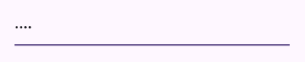

# UI部品

## テキスト

文字は、`Text`クラスを利用します。1番目の引数が表示する文字で、文字の大きさや色を変更する場合には、名前付きの引数を利用します。

``` dart linenums="1"
const Text(
  'Textのテスト',
  style: TextStyle(
    color: Colors.blue,
    fontSize: 30.0,
    fontWeight: FontWeight.bold,
  ),
),
```

次のように長い文字列をいれると、自動で折り返します。

``` dart linenums="1"
body: Column(
  children: [
    const Text(
      'Textのテスト長い文字列をいれるとどうなるかのテスト',
      style: TextStyle(
        color: Colors.blue,
        fontSize: 30.0,
        fontWeight: FontWeight.bold,
      ),
    ),
  ],
),
```


## テキスト入力

次のレイアウトを基準に作成していきます。

``` dart linenums="1"
import 'package:flutter/material.dart';

void main() {
  runApp(const MyApp());
}

class MyApp extends StatelessWidget {
  const MyApp({super.key});

  @override
  Widget build(BuildContext context) {
    return MaterialApp(
      title: 'Flutter Demo',
      theme: ThemeData(
        colorScheme: ColorScheme.fromSeed(seedColor: Colors.deepPurple),
        useMaterial3: true,
      ),
      home: const LayoutTest(),
    );
  }
}

class LayoutTest extends StatelessWidget {
  const LayoutTest({super.key});

  @override
  Widget build(BuildContext context) {
    return Scaffold(
      appBar: AppBar(
        title: const Text('レイアウトテスト'),
      ),
      body: Column(
        children: [
          Container(
            padding: const EdgeInsets.all(20.0),
            child: const TextField(),
          ),
        ],
      ),
    );
  }
}
```

テキストフィールドは`TextField`クラスを使用します。引数なしで指定すると次のように表示されます。


### キーボードを変更

テキストフィールドに入力するものによって、キーボードを変えることができます。そのためには、`keyboardType`を指定します。指定できる値をいくつか確認します。

`TextInputType.number`を指定すると次のように数字のみのキーボードになります。


`TextInputType.phone`を指定すると次のように電話に必要なキーのみのキーボードになります。


`TextInputType.emailAddress`を指定すると次のようにメールアドレスに必要なキーのみのキーボードになります。


### 文字数の制限

`maxLength`を指定すると入力可能な文字数を制限できます。例えば`3`を指定すると次のようになります。`maxLength`を指定すると、テキストフィールドの右下に`2/3`のように何文字まで入力できて、今何文字入力しているかが表示されます。

``` dart linenums="1"
const TextField(maxLength: 3),
```


絵文字もきちんとカウントしてくれます。


### 入力を隠す

パスワード等を入力する場合には、入力している文字を表示したくありません。そのような場合には、`obscureText`を`true`にすることで、入力文字が見えなくなります。



### 長いテキストの入力

`TextField`はデフォルトで文字の折り返しはしません。改行も入りません。複数行になるような長いテキストを入力させたい場合には、次のように`keyboardType`と`maxLines`を指定します。

``` dart linenums="1"
const TextField(
  keyboardType: TextInputType.multiline,
  maxLines: null,
),
```


### 装飾する

テキストフィールドを装飾するには、`decoration`に設定をします。`decoration`には`InputDecoration`クラスを指定します。

枠線を入れる場合には次のようにします。

``` dart linenums="1"
const TextField(
  decoration: InputDecoration(
    border: OutlineInputBorder(),
  ),
),
```


`labelText`を追加するとヒントを表示できます。

``` dart linenums="1"
const TextField(
  decoration: InputDecoration(
    border: OutlineInputBorder(),
    labelText: '名前を入力',
  ),
),
```

`labelText`は面白い動きをし、最初は次のように表示されています。


その後、フォーカスが当たると次のようになります。


### 入力された値の取得

テキストフィールドに入力された値の取得をするには、`TextEditingController`を使います。

``` dart linenums="1"
class _MyHomePageState extends State<MyHomePage> {
  var _input = '';
  final _textController = TextEditingController();

  @override
  Widget build(BuildContext context) {
    return Scaffold(
      appBar: AppBar(
        title: Text(widget.title),
      ),
      body: Column(
        children: [
          Padding(
            padding: EdgeInsets.all(10.0),
            child: TextField(controller: _textController),
          ),
          FilledButton(
            onPressed: () {
              setState(() {
                _input = _textController.text;
              });
            },
            child: const Text('ボタン'),
          ),
          Text('入力された文字: $_input'),
          FilledButton(
            onPressed: () {},
            child: const Text('テキストフィールド変更！'),
          ),
        ],
      ),
    );
  }
}
```

クラスのフィールドとして`TextEditingController`のインスタンスを作成します。そのインスタンスをテキストフィールドの`controller`に割り当てます。これは、テキストフィールドの数だけ必要になります。

操作する場合には、インスタンスの`text`プロパティを読み込むと入力されているデータが受け取れ、`text`プロパティに代入すると入力されている内容が変更されます。

### 入力チェック

テキストフィールドに対して入力チェックをしたい場合には、`TextFormField`を使います。

``` dart linenums="1"
class _MyHomePageState extends State<MyHomePage> {
  @override
  Widget build(BuildContext context) {
    return Scaffold(
      appBar: AppBar(
        title: Text(widget.title),
      ),
      body: Column(
        children: [
          Padding(
            padding: const EdgeInsets.all(10.0),
            child: TextFormField(
              autovalidateMode: AutovalidateMode.onUserInteraction,
              validator: (value) {
                if (value == null || value.isEmpty) {
                  return '必須です';
                }
                if (value.length < 5) {
                  return '5文字以上必要です';
                }
                return null;
              },
            ),
          ),
        ],
      ),
    );
  }
}
```

## チェックボックス

チェックボックスは、チェックの状態を持つため`StatefulWidget`として作成する必要があります。まず全体像を確認します。

``` dart linenums="1"
import 'package:flutter/material.dart';

void main() {
  runApp(const MyApp());
}

class MyApp extends StatelessWidget {
  const MyApp({super.key});

  @override
  Widget build(BuildContext context) {
    return MaterialApp(
      title: 'Flutter Demo',
      theme: ThemeData(
        colorScheme: ColorScheme.fromSeed(seedColor: Colors.deepPurple),
        useMaterial3: true,
      ),
      home: const MyHomePage(title: 'Flutter Demo Home Page'),
    );
  }
}

class MyHomePage extends StatefulWidget {
  const MyHomePage({Key? key, required this.title}) : super(key: key);

  final String title;

  @override
  State<MyHomePage> createState() => _MyHomePageState();
}

class _MyHomePageState extends State<MyHomePage> {
  bool? _check = false;

  @override
  Widget build(BuildContext context) {
    return Scaffold(
      appBar: AppBar(
        title: Text(widget.title),
      ),
      body: Column(
        children: [
          Checkbox(
            value: _check,
            onChanged: (bool? value) {
              setState(() => _check = value);
            },
          )
        ],
      ),
    );
  }
}
```

これでチェックボックスが作成できます。


!!! note "チェックボックスの不定状態"

    チェックボックスの`onChanged`メソッドの引数が`bool?`になっているのは、`null`にすることがあるためです。`null`の状態は不定状態といい、次のような表示になります。

    

    ただ、デフォルトでは`value`を`null`にすることはできず、引数`tristate`を`true`とすることで`value`を`null`にする事ができます。

チェックボックスにラベルをつけるには、`CheckboxListTile`を使います。`Checkbox`との違いは`title`を指定するかどうかです。

``` dart linenums="1"
CheckboxListTile(
  title: const Text('確認しました'),
  value: _check,
  onChanged: (bool? value) {
    setState(() => _check = value);
  },
),
```


## スイッチ

チェックボックスと同様のもので、スイッチがあります。

``` dart linenums="1"
SwitchListTile(
  title: const Text('確認しました'),
  value: _check,
  onChanged: (bool value) {
    setState(() => _check = value);
  },
)
```


!!! note "チェックボックスとスイッチの使い分け"

    チェックボックスもスイッチもどちらもONとOFFを表す部品です。使い分けとしては次のように考えると良いです。

    - チェックボックスを使う場面
        - 複数選択する場合
        - 単一の選択でも即時反映をしない場合。例えば、利用規約に同意する場合にはチェックのような場面
    - スイッチを使う場面
        - Wi-Fiのオン・オフのようにすぐに切り替える場合

    
    

## ラジオボタン

ラジオボタンは、グループの中で1つだけ選択できるボタンです。グループの設定をするクラスと、選択項目のクラスの2つがあります。

グループの設定をするのが`RadioGroup`クラスです。次の例では、`groupValue`として1つ変数を割り当てています。この変数の値が現在選択されているボタンを表します。例の場合には`int?`型の`_selectedValue`を割り当てています。この変数を`null`にした場合には未選択の状態になります。また、ラジオボタンが押されたときには`onChanged`に指定した関数が呼び出されます。

ラジオボタン自体は`RadioListTile`を使うのが簡単です。`title`にボタンの見出しを設定します。`value`には、このラジオボタンの値を指定します。`RadioGroup`の`groupValue`がこの値のときに、ラジオボタンが選択されている状態になります。

``` dart linenums="1"
class _MyHomePageState extends State<MyHomePage> {
  int? _selectedValue;

  @override
  Widget build(BuildContext context) {
    return Scaffold(
      appBar: AppBar(
        backgroundColor: Theme.of(context).colorScheme.inversePrimary,
        title: Text(widget.title),
      ),
      body: Column(
        children: [
          RadioGroup<int>(
            groupValue: _selectedValue,
            onChanged: (int? value) {
              setState(() {
                _selectedValue = value;
              });
            },
            child: const Column(
              children: <Widget>[
                RadioListTile<int>(title: Text('グー'), value: 0),
                RadioListTile<int>(title: Text('チョキ'), value: 1),
                RadioListTile<int>(title: Text('パー'), value: 2),
              ],
            ),
          ),
        ],
      ),
    );
  }
}
```


このラジオボタンは`for`ループを使って書き換えることができます。

``` dart linenums="1"
body: Column(
    children: [
      RadioGroup<int>(
        groupValue: _selectedValue,
        onChanged: (int? value) {
          setState(() {
            _selectedValue = value;
          });
        },
        child: Column(
          children: [
            for (var i = 0; i < _labels.length; i++)
              RadioListTile<int>(title: Text(_labels[i]), value: i),
          ],
        ),
      ),
    ],
  ),
```

### enumを使う

ラジオボタンの最初の例では`int`型を使いましたが、`enum`を使ったほうがスッキリと書くことができます。

``` dart linenums="1"
enum Janken {
  gu('グー'),
  choki('チョキ'),
  pa('パー');

  final String label;

  const Janken(this.label);
}

class _MyHomePageState extends State<MyHomePage> {
  Janken? _janken = Janken.gu;

  @override
  Widget build(BuildContext context) {
    return Scaffold(
      appBar: AppBar(
        backgroundColor: Theme.of(context).colorScheme.inversePrimary,
        title: Text(widget.title),
      ),
      body: Column(
        children: [
          RadioGroup<Janken>(
            groupValue: _janken,
            onChanged: (Janken? value) {
              setState(() {
                _janken = value;
              });
            },
            child: Column(
              children: [
                for (final j in Janken.values)
                  RadioListTile<Janken>(title: Text(j.label), value: j),
              ],
            ),
          ),
        ],
      ),
    );
  }
}
```

## ドロップダウンリスト

``` dart linenums="1"
class MyHomePage extends StatefulWidget {
  const MyHomePage({Key? key, required this.title}) : super(key: key);

  final String title;

  @override
  State<MyHomePage> createState() => _MyHomePageState();
}

class _MyHomePageState extends State<MyHomePage> {
  String? _isSelectedItem = '1';

  @override
  Widget build(BuildContext context) {
    return Scaffold(
      appBar: AppBar(
        title: const Text('ドロップダウン'),
      ),
      body: Column(
        children: [
          DropdownButton(
            items: const [
              DropdownMenuItem(
                value: '1',
                child: Text('北海道'),
              ),
              DropdownMenuItem(
                value: '2',
                child: Text('東京都'),
              ),
              DropdownMenuItem(
                value: '3',
                child: Text('沖縄県'),
              ),
            ],
            onChanged: (String? value) {
              setState(() {
                _isSelectedItem = value;
              });
            },
            value: _isSelectedItem,
          ),
          Text('$_isSelectedItem が選択されました。')
        ],
      ),
    );
  }
}
```


## ボタン

ボタンは9種類あります。

``` dart linenums="1"
import 'package:flutter/material.dart';

void main() {
  runApp(const MyApp());
}

class MyApp extends StatelessWidget {
  const MyApp({Key? key}) : super(key: key);

  @override
  Widget build(BuildContext context) {
    return MaterialApp(
      title: 'Flutter Demo',
      theme: ThemeData(
        colorScheme: ColorScheme.fromSeed(seedColor: Colors.deepPurple),
        useMaterial3: true,
      ),
      home: const MyHomePage(title: 'Flutter Demo Home Page'),
    );
  }
}

class MyHomePage extends StatefulWidget {
  const MyHomePage({Key? key, required this.title}) : super(key: key);

  final String title;

  @override
  State<MyHomePage> createState() => _MyHomePageState();
}

enum Size { xs, s, m, l, xl }

class _MyHomePageState extends State<MyHomePage> {
  var selectedSize = Size.xs;

  @override
  Widget build(BuildContext context) {
    return Scaffold(
      appBar: AppBar(
        title: Text(widget.title),
      ),
      body: Center(
        child: Column(
          children: [
            ElevatedButton(
              onPressed: () {},
              child: const Text('Elevated'),
            ),
            const SizedBox(height: 15.0),
            FilledButton(
              onPressed: () {},
              child: const Text('Filled'),
            ),
            const SizedBox(height: 15.0),
            FilledButton.tonal(
              onPressed: () {},
              child: const Text('Filled tonal'),
            ),
            const SizedBox(height: 15.0),
            OutlinedButton(
              onPressed: () {},
              child: const Text('Outlined'),
            ),
            const SizedBox(height: 15.0),
            TextButton(
              onPressed: () {},
              child: const Text('Text'),
            ),
            const SizedBox(height: 15.0),
            IconButton(
              onPressed: () {},
              icon: const Icon(Icons.home_outlined),
            ),
            const SizedBox(height: 15.0),
            SegmentedButton<Size>(
              segments: const [
                ButtonSegment<Size>(
                  value: Size.xs,
                  label: Text('XS'),
                ),
                ButtonSegment<Size>(
                  value: Size.s,
                  label: Text('S'),
                ),
                ButtonSegment<Size>(
                  value: Size.m,
                  label: Text('M'),
                ),
                ButtonSegment<Size>(
                  value: Size.l,
                  label: Text('L'),
                ),
                ButtonSegment<Size>(
                  value: Size.xl,
                  label: Text('XL'),
                ),
              ],
              selected: {selectedSize},
              onSelectionChanged: (newSelected) {
                setState(() {
                  selectedSize = newSelected.first;
                });
              },
            ),
            const SizedBox(height: 15.0),
            FloatingActionButton(
              onPressed: () {},
              child: const Icon(Icons.home),
            ),
            const SizedBox(height: 15.0),
            FloatingActionButton.extended(
                onPressed: () {},
                icon: const Icon(Icons.home),
                label: const Text('Extended FAB')),
          ],
        ),
      ),
    );
  }
}
```

実行結果は次のようになります。


それぞれ上から、

1. Elevated button
2. Filled button
3. Filled tonal button
4. Outlined button
5. Text button
6. Icon button
7. Segmented button
8. Floating action button（FAB）
9. Extended FAB

という名前です。

[使い分けの詳細は、マテリアルデザインのサイト](https://m3.material.io/components/all-buttons){target=_blank}で確認してください。

## 日付の選択

日付は`DatePicker`を使うのが便利です。日本語でなければ特別な設定はいらないのですが、日本語にするためには少し設定が必要です。

設定は、`pubspec.yaml`ファイルに次の設定を追加します。

``` yaml
  flutter_localizations:
    sdk: flutter
```

記載する場所は決まっていて、`dependencies`の下で、`flutter`の下にしてください。

``` yaml hl_lines="4-5"
dependencies:
  flutter:
    sdk: flutter
  flutter_localizations:
    sdk: flutter
```

日付の選択画面を日本語にするためには、まず`import`を先頭に追加します。

``` dart linenums="1"
import 'package:flutter_localizations/flutter_localizations.dart';
```

また、`MyApp`の中の

``` dart linenums="1" hl_lines="13-20"
class MyApp extends StatelessWidget {
  const MyApp({super.key});

  @override
  Widget build(BuildContext context) {
    return MaterialApp(
      title: 'Flutter Demo',
      theme: ThemeData(
        colorScheme: ColorScheme.fromSeed(seedColor: Colors.deepPurple),
        useMaterial3: true,
      ),
      home: const MyHomePage(title: 'Flutter Demo Home Page'),
      localizationsDelegates: const [
        GlobalMaterialLocalizations.delegate,
        GlobalWidgetsLocalizations.delegate,
      ],
      supportedLocales: const [
        Locale('en'),
        Locale('ja'),
      ],
    );
  }
}
```

ここまで行うことで、日本語で表示されます。

日付の選択画面のコードは次のメソッドを作成します。

``` dart linenums="1"
DateTime? _date;

void _onPress() async {
  final picked = await showDatePicker(
    locale: const Locale('ja'),
    context: context,
    initialDate: DateTime.now(),
    firstDate: DateTime(2024),
    lastDate: DateTime.now().add(
      const Duration(days: 366),
    ),
  );

  if (picked == null) return;

  setState(() => _date = picked);
}
```

呼び出す部分は次のとおりです。

``` dart linenums="1"
Column(
  children: [
    Text(
      '$_date',
      style: const TextStyle(
        fontSize: 20.0,
      ),
    ),
    FilledButton(
      onPressed: _onPress,
      child: const Text('日付選択'),
    ),
  ],
),
```

完成後は、次のようなイメージになります。


## 時刻の選択

時刻の選択はフィールドと、メソッドを用意します。

``` dart linenums="1"
  TimeOfDay? _time;

  void _onPress2() async {
    final picked = await showTimePicker(
      context: context,
      initialTime: TimeOfDay.now(),
      builder: (BuildContext context, Widget? child) => MediaQuery(
        data: MediaQuery.of(context).copyWith(alwaysUse24HourFormat: false),
        child: Localizations.override(
          context: context,
          locale: const Locale('ja', 'JP'),
          child: child!,
        ),
      ),
    );

    if (picked == null) return;

    setState(() => _time = picked);
  }
```

後は、表示部分に次のものを追加します。

``` dart linenums="1"
Text(
  '$_time',
  style: const TextStyle(
    fontSize: 20.0,
  ),
),
FilledButton(
  onPressed: _onPress2,
  child: const Text('時刻選択'),
),
```


## 練習問題

### 練習問題1

次のレイアウトになるように画面を作成すること。


??? 解答例

    ```dart
    import 'package:flutter/material.dart';

    void main() {
      runApp(const MyApp());
    }

    class MyApp extends StatelessWidget {
      const MyApp({Key? key}) : super(key: key);

      @override
      Widget build(BuildContext context) {
        return MaterialApp(
          title: 'Flutter Demo',
          theme: ThemeData(
            colorScheme: ColorScheme.fromSeed(seedColor: Colors.deepPurple),
            useMaterial3: true,
          ),
          home: const MyHomePage(title: 'Flutter Demo Home Page'),
        );
      }
    }

    class MyHomePage extends StatefulWidget {
      const MyHomePage({Key? key, required this.title}) : super(key: key);

      final String title;

      @override
      State<MyHomePage> createState() => _MyHomePageState();
    }

    enum Size { xs, s, m, l, xl }

    class _MyHomePageState extends State<MyHomePage> {
      var selectedSize = Size.xs;

      @override
      Widget build(BuildContext context) {
        return Scaffold(
          appBar: AppBar(
            title: Text(widget.title),
          ),
          body: const Column(
            mainAxisAlignment: MainAxisAlignment.spaceBetween,
            children: [
              Row(
                mainAxisAlignment: MainAxisAlignment.spaceBetween,
                children: [
                  Text('左'),
                  Text('右'),
                ],
              ),
              Row(
                mainAxisAlignment: MainAxisAlignment.spaceBetween,
                children: [
                  Text('左'),
                  Text('右'),
                ],
              ),
            ],
          ),
        );
      }
    }
    ```

### 練習問題2

次のレイアウトになるように画面を作成すること。


テキストフィールドのキーボードは電話番号に特化したキーボードとすること。

画面のボタンは、`ElevatedButton`。必要な引数は次の2つ。

- `onPressed`: ボタンが押されたときに呼び出される関数。今は何もしなくて良いので、`() {}`としておく
- `child`: ボタンに表示する内容。文字を表示する場合には`Text`を指定する

??? 解答例

    ```dart
    import 'package:flutter/material.dart';

    void main() {
      runApp(const MyApp());
    }

    class MyApp extends StatelessWidget {
      const MyApp({Key? key}) : super(key: key);

      @override
      Widget build(BuildContext context) {
        return MaterialApp(
          title: 'Flutter Demo',
          theme: ThemeData(
            primarySwatch: Colors.blue,
          ),
          home: const MyHomePage(title: 'Flutter Demo Home Page'),
        );
      }
    }

    class MyHomePage extends StatefulWidget {
      const MyHomePage({Key? key, required this.title}) : super(key: key);

      final String title;

      @override
      State<MyHomePage> createState() => _MyHomePageState();
    }

    class _MyHomePageState extends State<MyHomePage> {
      int _counter = 0;

      void _incrementCounter() {
        setState(() {
          _counter++;
        });
      }

      @override
      Widget build(BuildContext context) {
        return Scaffold(
          appBar: AppBar(
            title: Text(widget.title),
          ),
          body: Column(
            children: [
              const Text('電話番号'),
              const Padding(
                padding: EdgeInsets.only(
                  left: 10.0,
                  right: 10.0,
                ),
                child: TextField(
                  keyboardType: TextInputType.phone,
                  maxLength: 15,
                ),
              ),
              ElevatedButton(
                onPressed: () {},
                child: const Text('送信'),
              )
            ],
          ),
        );
      }
    }
    ```

### 練習問題3

次のレイアウトになるように画面を作成すること。


真ん中の青い文字は、`TextButton`。引数は`ElevatedButton`と同じ。

チェックボックスは、状態を変化させないとチェックマークがつかないので注意。

??? 解答例

    ```dart
    import 'package:flutter/material.dart';

    void main() {
      runApp(const MyApp());
    }

    class MyApp extends StatelessWidget {
      const MyApp({super.key});

      @override
      Widget build(BuildContext context) {
        return MaterialApp(
          title: 'Flutter Demo',
          theme: ThemeData(
            colorScheme: ColorScheme.fromSeed(seedColor: Colors.deepPurple),
            useMaterial3: true,
          ),
          home: const MyHomePage(title: 'Flutter Demo Home Page'),
        );
      }
    }

    class MyHomePage extends StatefulWidget {
      const MyHomePage({Key? key, required this.title}) : super(key: key);

      final String title;

      @override
      State<MyHomePage> createState() => _MyHomePageState();
    }

    class _MyHomePageState extends State<MyHomePage> {
      bool? _checked = false;

      @override
      Widget build(BuildContext context) {
        return Scaffold(
          appBar: AppBar(
            title: Text(widget.title),
          ),
          body: Column(
            children: [
              const Text('利用規約'),
              TextButton(
                onPressed: () {},
                child: const Text('利用規約を読む'),
              ),
              CheckboxListTile(
                title: const Text('利用規約を確認しました'),
                value: _checked,
                onChanged: (value) {
                  setState(() {
                    _checked = value;
                  });
                },
              ),
            ],
          ),
        );
      }
    }
    ```

### 練習問題4

次のレイアウトになるように画面を作成すること。


??? 解答例

    ```dart
    import 'package:flutter/material.dart';

    void main() {
      runApp(const MyApp());
    }

    class MyApp extends StatelessWidget {
      const MyApp({super.key});

      @override
      Widget build(BuildContext context) {
        return MaterialApp(
          title: 'Flutter Demo',
          theme: ThemeData(
            colorScheme: ColorScheme.fromSeed(seedColor: Colors.deepPurple),
            useMaterial3: true,
          ),
          home: const MyHomePage(title: 'Flutter Demo Home Page'),
        );
      }
    }

    class MyHomePage extends StatefulWidget {
      const MyHomePage({Key? key, required this.title}) : super(key: key);

      final String title;

      @override
      State<MyHomePage> createState() => _MyHomePageState();
    }

    class _MyHomePageState extends State<MyHomePage> {
      int? _value = 1;

      @override
      Widget build(BuildContext context) {
        return Scaffold(
          appBar: AppBar(
            title: Text(widget.title),
          ),
          body: Column(
            children: [
              for (var i = 1; i <= 3; i++)
                RadioListTile<int>(
                  title: Text('$i'),
                  value: i,
                  groupValue: _value,
                  onChanged: (value) {
                    setState(() {
                      _value = value;
                    });
                  },
                ),
            ],
          ),
        );
      }
    }
    ```

### 練習問題5

次の動画のようになるようにアプリを作成すること。ボタンは`FilledButton`。

<video src="image/ex05.mp4" controls width="400"></video>

### 練習問題6

次の動画のようになるようにアプリを作成すること。

<video src="image/ex06.mp4" controls width="400"></video>
