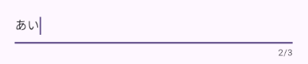

# UI部品

## テキスト

次のレイアウトを基準に作成していきます。

<pre>
<code class="language-run-dartpad:theme-light:mode-flutter:ga_id-example1">
import &#x27;package:flutter/material.dart&#x27;;

void main() {
  runApp(const MyApp());
}

class MyApp extends StatelessWidget {
  const MyApp({super.key});

  @override
  Widget build(BuildContext context) {
    return MaterialApp(
      title: &#x27;Flutter Demo&#x27;,
      theme: ThemeData(
        colorScheme: ColorScheme.fromSeed(seedColor: Colors.deepPurple),
        useMaterial3: true,
      ),
      home: const LayoutTest(),
    );
  }
}

class LayoutTest extends StatelessWidget {
  const LayoutTest({Key? key}) : super(key: key);

  @override
  Widget build(BuildContext context) {
    return Scaffold(
      appBar: AppBar(
        title: const Text(&#x27;レイアウトテスト&#x27;),
      ),
      body: Column(
        children: [
          Container(
            padding: const EdgeInsets.all(20.0),
            child: const TextField(),
          ),
        ],
      ),
    );
  }
}
</code>
</pre>

??? オフライン用

    ```dart
    import 'package:flutter/material.dart';
    
    void main() {
      runApp(const MyApp());
    }
    
    class MyApp extends StatelessWidget {
      const MyApp({super.key});
    
      @override
      Widget build(BuildContext context) {
        return MaterialApp(
          title: 'Flutter Demo',
          theme: ThemeData(
            colorScheme: ColorScheme.fromSeed(seedColor: Colors.deepPurple),
            useMaterial3: true,
          ),
          home: const LayoutTest(),
        );
      }
    }
    
    class LayoutTest extends StatelessWidget {
      const LayoutTest({Key? key}) : super(key: key);
    
      @override
      Widget build(BuildContext context) {
        return Scaffold(
          appBar: AppBar(
            title: const Text('レイアウトテスト'),
          ),
          body: Column(
            children: [
              Container(
                padding: const EdgeInsets.all(20.0),
                child: const TextField(),
              ),
            ],
          ),
        );
      }
    }
    ```

テキストフィールドは`TextField`クラスを使用します。引数なしで指定すると次のように表示されます。


### キーボードを変更

テキストフィールドに入力するものによって、キーボードを変えることができます。そのためには、`keyboardType`を指定します。指定できる値をいくつか確認します。

`TextInputType.number`を指定すると次のように数字のみのキーボードになります。


`TextInputType.phone`を指定すると次のように電話に必要なキーのみのキーボードになります。


`TextInputType.emailAddress`を指定すると次のようにメールアドレスに必要なキーのみのキーボードになります。


### 文字数の制限

`maxLength`を指定すると入力可能な文字数を制限できます。例えば`3`を指定すると次のようになります。`maxLength`を指定すると、テキストフィールドの右下に`2/3`のように何文字まで入力できて、今何文字入力しているかが表示されます。



### 入力を隠す

パスワード等を入力する場合には、入力している文字を表示したくありません。そのような場合には、`obscureText`を`true`にすることで、入力文字が見えなくなります。


### 装飾する

テキストフィールドを装飾するには、`decoration`に設定をします。`decoration`には`InputDecoration`クラスを指定します。

枠線を入れる場合には次のようにします。

```dart
const TextField(
  decoration: InputDecoration(
    border: OutlineInputBorder(),
  ),
),
```


`labelText`を追加するとヒントを表示できます。

```dart
const TextField(
  decoration: InputDecoration(
    border: OutlineInputBorder(),
    labelText: '名前を入力',
  ),
),
```

`labelText`は面白い動きをし、最初は次のように表示されています。


その後、フォーカスが当たると次のようになります。


## チェックボックス

チェックボックスは、チェックの状態を持つため`StatefulWidget`として作成する必要があります。まず全体像を確認します。

<pre>
<code class="language-run-dartpad:theme-light:mode-flutter:ga_id-example1">
import &#x27;package:flutter/material.dart&#x27;;

void main() {
  runApp(const MyApp());
}

class MyApp extends StatelessWidget {
  const MyApp({super.key});

  @override
  Widget build(BuildContext context) {
    return MaterialApp(
      title: &#x27;Flutter Demo&#x27;,
      theme: ThemeData(
        colorScheme: ColorScheme.fromSeed(seedColor: Colors.deepPurple),
        useMaterial3: true,
      ),
      home: const MyHomePage(title: &#x27;Flutter Demo Home Page&#x27;),
    );
  }
}

class MyHomePage extends StatefulWidget {
  const MyHomePage({Key? key, required this.title}) : super(key: key);

  final String title;

  @override
  State&lt;MyHomePage&gt; createState() =&gt; _MyHomePageState();
}

class _MyHomePageState extends State&lt;MyHomePage&gt; {
  bool? _check = false;

  @override
  Widget build(BuildContext context) {
    return Scaffold(
      appBar: AppBar(
        title: Text(widget.title),
      ),
      body: Column(
        children: [
          Checkbox(
            value: _check,
            onChanged: (bool? value) {
              setState(() =&gt; _check = value);
            },
          )
        ],
      ),
    );
  }
}
</code>
</pre>

??? オフライン用

    ```dart
    import 'package:flutter/material.dart';
    
    void main() {
      runApp(const MyApp());
    }
    
    class MyApp extends StatelessWidget {
      const MyApp({super.key});
    
      @override
      Widget build(BuildContext context) {
        return MaterialApp(
          title: 'Flutter Demo',
          theme: ThemeData(
            colorScheme: ColorScheme.fromSeed(seedColor: Colors.deepPurple),
            useMaterial3: true,
          ),
          home: const MyHomePage(title: 'Flutter Demo Home Page'),
        );
      }
    }
    
    class MyHomePage extends StatefulWidget {
      const MyHomePage({Key? key, required this.title}) : super(key: key);
    
      final String title;
    
      @override
      State<MyHomePage> createState() => _MyHomePageState();
    }
    
    class _MyHomePageState extends State<MyHomePage> {
      bool? _check = false;
    
      @override
      Widget build(BuildContext context) {
        return Scaffold(
          appBar: AppBar(
            title: Text(widget.title),
          ),
          body: Column(
            children: [
              Checkbox(
                value: _check,
                onChanged: (bool? value) {
                  setState(() => _check = value);
                },
              )
            ],
          ),
        );
      }
    }
    ```

これでチェックボックスが作成できます。


チェックボックスにラベルをつけるには、`CheckboxListTile`を使います。`Checkbox`との違いは`title`を指定するかどうかです。

```dart
CheckboxListTile(
  title: const Text('確認しました'),
  value: _check,
  onChanged: (bool? value) {
    setState(() => _check = value);
  },
),
```


## スイッチ

チェックボックスと同様のもので、スイッチの形をしたものが使えます。

```dart
SwitchListTile(
  title: const Text('確認しました'),
  value: _check,
  onChanged: (bool value) {
    setState(() => _check = value);
  },
)
```


## ラジオボタン

ラジオボタンは`enum`と一緒に使うと便利に使えます。

```dart
enum Janken { gu, choki, pa }

class _MyHomePageState extends State<MyHomePage> {
  Janken? _te = Janken.gu;

  @override
  Widget build(BuildContext context) {
    return Scaffold(
      appBar: AppBar(
        title: Text(widget.title),
      ),
      body: Column(
        children: [
          RadioListTile<Janken>(
            title: const Text('グー'),
            value: Janken.gu,
            groupValue: _te,
            onChanged: (Janken? value) {
              setState(() {
                _te = value;
              });
            },
          ),
          RadioListTile<Janken>(
            title: const Text('チョキ'),
            value: Janken.choki,
            groupValue: _te,
            onChanged: (Janken? value) {
              setState(() {
                _te = value;
              });
            },
          ),
          RadioListTile<Janken>(
            title: const Text('パー'),
            value: Janken.pa,
            groupValue: _te,
            onChanged: (Janken? value) {
              setState(() {
                _te = value;
              });
            },
          ),
        ],
      ),
    );
  }
}
```


## ドロップダウンリスト

```dart
class MyHomePage extends StatefulWidget {
  const MyHomePage({Key? key, required this.title}) : super(key: key);

  final String title;

  @override
  State<MyHomePage> createState() => _MyHomePageState();
}

class _MyHomePageState extends State<MyHomePage> {
  String? _isSelectedItem = '1';

  @override
  Widget build(BuildContext context) {
    return Scaffold(
      appBar: AppBar(
        title: const Text('ドロップダウン'),
      ),
      body: Column(
        children: [
          DropdownButton(
            items: const [
              DropdownMenuItem(
                value: '1',
                child: Text('北海道'),
              ),
              DropdownMenuItem(
                value: '2',
                child: Text('東京都'),
              ),
              DropdownMenuItem(
                value: '3',
                child: Text('沖縄県'),
              ),
            ],
            onChanged: (String? value) {
              setState(() {
                _isSelectedItem = value;
              });
            },
            value: _isSelectedItem,
          ),
          Text('$_isSelectedItem が選択されました。')
        ],
      ),
    );
  }
}
```


## ボタン

ボタンは9種類あります。

<pre>
<code class="language-run-dartpad:theme-light:mode-flutter:ga_id-example1">
import &#x27;package:flutter/material.dart&#x27;;

void main() {
  runApp(const MyApp());
}

class MyApp extends StatelessWidget {
  const MyApp({Key? key}) : super(key: key);

  @override
  Widget build(BuildContext context) {
    return MaterialApp(
      title: &#x27;Flutter Demo&#x27;,
      theme: ThemeData(
        colorScheme: ColorScheme.fromSeed(seedColor: Colors.deepPurple),
        useMaterial3: true,
      ),
      home: const MyHomePage(title: &#x27;Flutter Demo Home Page&#x27;),
    );
  }
}

class MyHomePage extends StatefulWidget {
  const MyHomePage({Key? key, required this.title}) : super(key: key);

  final String title;

  @override
  State&lt;MyHomePage&gt; createState() =&gt; _MyHomePageState();
}

enum Size { xs, s, m, l, xl }

class _MyHomePageState extends State&lt;MyHomePage&gt; {
  var selectedSize = Size.xs;

  @override
  Widget build(BuildContext context) {
    return Scaffold(
      appBar: AppBar(
        title: Text(widget.title),
      ),
      body: Center(
        child: Column(
          children: [
            ElevatedButton(
              onPressed: () {},
              child: const Text(&#x27;Elevated&#x27;),
            ),
            const SizedBox(height: 15.0),
            FilledButton(
              onPressed: () {},
              child: const Text(&#x27;Filled&#x27;),
            ),
            const SizedBox(height: 15.0),
            FilledButton.tonal(
              onPressed: () {},
              child: const Text(&#x27;Filled tonal&#x27;),
            ),
            const SizedBox(height: 15.0),
            OutlinedButton(
              onPressed: () {},
              child: const Text(&#x27;Outlined&#x27;),
            ),
            const SizedBox(height: 15.0),
            TextButton(
              onPressed: () {},
              child: const Text(&#x27;Text&#x27;),
            ),
            const SizedBox(height: 15.0),
            IconButton(
              onPressed: () {},
              icon: const Icon(Icons.home_outlined),
            ),
            const SizedBox(height: 15.0),
            SegmentedButton&lt;Size&gt;(
              segments: const [
                ButtonSegment&lt;Size&gt;(
                  value: Size.xs,
                  label: Text(&#x27;XS&#x27;),
                ),
                ButtonSegment&lt;Size&gt;(
                  value: Size.s,
                  label: Text(&#x27;S&#x27;),
                ),
                ButtonSegment&lt;Size&gt;(
                  value: Size.m,
                  label: Text(&#x27;M&#x27;),
                ),
                ButtonSegment&lt;Size&gt;(
                  value: Size.l,
                  label: Text(&#x27;L&#x27;),
                ),
                ButtonSegment&lt;Size&gt;(
                  value: Size.xl,
                  label: Text(&#x27;XL&#x27;),
                ),
              ],
              selected: {selectedSize},
              onSelectionChanged: (newSelected) {
                setState(() {
                  selectedSize = newSelected.first;
                });
              },
            ),
            const SizedBox(height: 15.0),
            FloatingActionButton(
              onPressed: () {},
              child: const Icon(Icons.home),
            ),
            const SizedBox(height: 15.0),
            FloatingActionButton.extended(
                onPressed: () {},
                icon: const Icon(Icons.home),
                label: const Text(&#x27;Extended FAB&#x27;)),
          ],
        ),
      ),
    );
  }
}

</code>
</pre>

??? オフライン用

    ```dart
    import 'package:flutter/material.dart';

    void main() {
      runApp(const MyApp());
    }

    class MyApp extends StatelessWidget {
      const MyApp({Key? key}) : super(key: key);

      @override
      Widget build(BuildContext context) {
        return MaterialApp(
          title: 'Flutter Demo',
          theme: ThemeData(
            colorScheme: ColorScheme.fromSeed(seedColor: Colors.deepPurple),
            useMaterial3: true,
          ),
          home: const MyHomePage(title: 'Flutter Demo Home Page'),
        );
      }
    }

    class MyHomePage extends StatefulWidget {
      const MyHomePage({Key? key, required this.title}) : super(key: key);

      final String title;

      @override
      State<MyHomePage> createState() => _MyHomePageState();
    }

    enum Size { xs, s, m, l, xl }

    class _MyHomePageState extends State<MyHomePage> {
      var selectedSize = Size.xs;

      @override
      Widget build(BuildContext context) {
        return Scaffold(
          appBar: AppBar(
            title: Text(widget.title),
          ),
          body: Center(
            child: Column(
              children: [
                ElevatedButton(
                  onPressed: () {},
                  child: const Text('Elevated'),
                ),
                const SizedBox(height: 15.0),
                FilledButton(
                  onPressed: () {},
                  child: const Text('Filled'),
                ),
                const SizedBox(height: 15.0),
                FilledButton.tonal(
                  onPressed: () {},
                  child: const Text('Filled tonal'),
                ),
                const SizedBox(height: 15.0),
                OutlinedButton(
                  onPressed: () {},
                  child: const Text('Outlined'),
                ),
                const SizedBox(height: 15.0),
                TextButton(
                  onPressed: () {},
                  child: const Text('Text'),
                ),
                const SizedBox(height: 15.0),
                IconButton(
                  onPressed: () {},
                  icon: const Icon(Icons.home_outlined),
                ),
                const SizedBox(height: 15.0),
                SegmentedButton<Size>(
                  segments: const [
                    ButtonSegment<Size>(
                      value: Size.xs,
                      label: Text('XS'),
                    ),
                    ButtonSegment<Size>(
                      value: Size.s,
                      label: Text('S'),
                    ),
                    ButtonSegment<Size>(
                      value: Size.m,
                      label: Text('M'),
                    ),
                    ButtonSegment<Size>(
                      value: Size.l,
                      label: Text('L'),
                    ),
                    ButtonSegment<Size>(
                      value: Size.xl,
                      label: Text('XL'),
                    ),
                  ],
                  selected: {selectedSize},
                  onSelectionChanged: (newSelected) {
                    setState(() {
                      selectedSize = newSelected.first;
                    });
                  },
                ),
                const SizedBox(height: 15.0),
                FloatingActionButton(
                  onPressed: () {},
                  child: const Icon(Icons.home),
                ),
                const SizedBox(height: 15.0),
                FloatingActionButton.extended(
                    onPressed: () {},
                    icon: const Icon(Icons.home),
                    label: const Text('Extended FAB')),
              ],
            ),
          ),
        );
      }
    }

    ```

実行結果は次のようになります。


それぞれ上から、

1. Elevated button
2. Filled button
3. Filled tonal button
4. Outlined button
5. Text button
6. Icon button
7. Segmented button
8. Floating action button（FAB）
9. Extended FAB

という名前です。

[使い分けの詳細は、マテリアルデザインのサイト](https://m3.material.io/components/all-buttons){target=_blank}で確認してください。

## 練習問題

### 練習問題1

次のレイアウトになるように画面を作成すること。


??? 解答例

    ```dart
    import 'package:flutter/material.dart';

    void main() {
      runApp(const MyApp());
    }

    class MyApp extends StatelessWidget {
      const MyApp({Key? key}) : super(key: key);

      @override
      Widget build(BuildContext context) {
        return MaterialApp(
          title: 'Flutter Demo',
          theme: ThemeData(
            colorScheme: ColorScheme.fromSeed(seedColor: Colors.deepPurple),
            useMaterial3: true,
          ),
          home: const MyHomePage(title: 'Flutter Demo Home Page'),
        );
      }
    }

    class MyHomePage extends StatefulWidget {
      const MyHomePage({Key? key, required this.title}) : super(key: key);

      final String title;

      @override
      State<MyHomePage> createState() => _MyHomePageState();
    }

    enum Size { xs, s, m, l, xl }

    class _MyHomePageState extends State<MyHomePage> {
      var selectedSize = Size.xs;

      @override
      Widget build(BuildContext context) {
        return Scaffold(
          appBar: AppBar(
            title: Text(widget.title),
          ),
          body: const Column(
            mainAxisAlignment: MainAxisAlignment.spaceBetween,
            children: [
              Row(
                mainAxisAlignment: MainAxisAlignment.spaceBetween,
                children: [
                  Text('左'),
                  Text('右'),
                ],
              ),
              Row(
                mainAxisAlignment: MainAxisAlignment.spaceBetween,
                children: [
                  Text('左'),
                  Text('右'),
                ],
              ),
            ],
          ),
        );
      }
    }
    ```

### 練習問題2

次のレイアウトになるように画面を作成すること。


テキストフィールドのキーボードは電話番号に特化したキーボードとすること。

画面のボタンは、`ElevatedButton`。必要な引数は次の2つ。

- `onPressed`: ボタンが押されたときに呼び出される関数。今は何もしなくて良いので、`() {}`としておく
- `child`: ボタンに表示する内容。文字を表示する場合には`Text`を指定する

??? 解答例

    ```dart
    import 'package:flutter/material.dart';

    void main() {
      runApp(const MyApp());
    }

    class MyApp extends StatelessWidget {
      const MyApp({Key? key}) : super(key: key);

      @override
      Widget build(BuildContext context) {
        return MaterialApp(
          title: 'Flutter Demo',
          theme: ThemeData(
            primarySwatch: Colors.blue,
          ),
          home: const MyHomePage(title: 'Flutter Demo Home Page'),
        );
      }
    }

    class MyHomePage extends StatefulWidget {
      const MyHomePage({Key? key, required this.title}) : super(key: key);

      final String title;

      @override
      State<MyHomePage> createState() => _MyHomePageState();
    }

    class _MyHomePageState extends State<MyHomePage> {
      int _counter = 0;

      void _incrementCounter() {
        setState(() {
          _counter++;
        });
      }

      @override
      Widget build(BuildContext context) {
        return Scaffold(
          appBar: AppBar(
            title: Text(widget.title),
          ),
          body: Column(
            children: [
              const Text('電話番号'),
              const Padding(
                padding: EdgeInsets.only(
                  left: 10.0,
                  right: 10.0,
                ),
                child: TextField(
                  keyboardType: TextInputType.phone,
                  maxLength: 15,
                ),
              ),
              ElevatedButton(
                onPressed: () {},
                child: const Text('送信'),
              )
            ],
          ),
        );
      }
    }
    ```

### 練習問題3

次のレイアウトになるように画面を作成すること。


真ん中の青い文字は、`TextButton`。引数は`ElevatedButton`と同じ。

チェックボックスは、状態を変化させないとチェックマークがつかないので注意。

??? 解答例

    ```dart
    import 'package:flutter/material.dart';
    
    void main() {
      runApp(const MyApp());
    }
    
    class MyApp extends StatelessWidget {
      const MyApp({super.key});
    
      @override
      Widget build(BuildContext context) {
        return MaterialApp(
          title: 'Flutter Demo',
          theme: ThemeData(
            colorScheme: ColorScheme.fromSeed(seedColor: Colors.deepPurple),
            useMaterial3: true,
          ),
          home: const MyHomePage(title: 'Flutter Demo Home Page'),
        );
      }
    }
    
    class MyHomePage extends StatefulWidget {
      const MyHomePage({Key? key, required this.title}) : super(key: key);
    
      final String title;
    
      @override
      State<MyHomePage> createState() => _MyHomePageState();
    }
    
    class _MyHomePageState extends State<MyHomePage> {
      bool? _checked = false;
    
      @override
      Widget build(BuildContext context) {
        return Scaffold(
          appBar: AppBar(
            title: Text(widget.title),
          ),
          body: Column(
            children: [
              const Text('利用規約'),
              TextButton(
                onPressed: () {},
                child: const Text('利用規約を読む'),
              ),
              CheckboxListTile(
                title: const Text('利用規約を確認しました'),
                value: _checked,
                onChanged: (value) {
                  setState(() {
                    _checked = value;
                  });
                },
              ),
            ],
          ),
        );
      }
    }
    ```

### 練習問題4

次のレイアウトになるように画面を作成すること。


??? 解答例

    ```dart
    import 'package:flutter/material.dart';
    
    void main() {
      runApp(const MyApp());
    }
    
    class MyApp extends StatelessWidget {
      const MyApp({super.key});
    
      @override
      Widget build(BuildContext context) {
        return MaterialApp(
          title: 'Flutter Demo',
          theme: ThemeData(
            colorScheme: ColorScheme.fromSeed(seedColor: Colors.deepPurple),
            useMaterial3: true,
          ),
          home: const MyHomePage(title: 'Flutter Demo Home Page'),
        );
      }
    }
    
    class MyHomePage extends StatefulWidget {
      const MyHomePage({Key? key, required this.title}) : super(key: key);
    
      final String title;
    
      @override
      State<MyHomePage> createState() => _MyHomePageState();
    }
    
    class _MyHomePageState extends State<MyHomePage> {
      int? _value = 1;
    
      @override
      Widget build(BuildContext context) {
        return Scaffold(
          appBar: AppBar(
            title: Text(widget.title),
          ),
          body: Column(
            children: [
              for (var i = 1; i <= 3; i++)
                RadioListTile<int>(
                  title: Text('$i'),
                  value: i,
                  groupValue: _value,
                  onChanged: (value) {
                    setState(() {
                      _value = value;
                    });
                  },
                ),
            ],
          ),
        );
      }
    }
    ```
