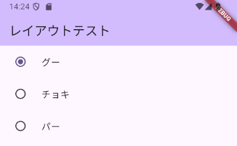

# UI部品

## テキスト

次のレイアウトを基準に作成していきます。

```dart
import 'package:flutter/material.dart';

void main() {
  runApp(const MyApp());
}

class MyApp extends StatelessWidget {
  const MyApp({Key? key}) : super(key: key);

  @override
  Widget build(BuildContext context) {
    return MaterialApp(
      title: 'Flutter Demo',
      theme: ThemeData(
        primarySwatch: Colors.blue,
      ),
      home: const LayoutTest(),
    );
  }
}

class LayoutTest extends StatelessWidget {
  const LayoutTest({Key? key}) : super(key: key);

  @override
  Widget build(BuildContext context) {
    return Scaffold(
      appBar: AppBar(
        title: const Text('レイアウトテスト'),
      ),
      body: Column(
        children: [
          Container(
            padding: const EdgeInsets.all(20.0),
            child: const TextField(),
          ),
        ],
      ),
    );
  }
}
```

テキストフィールドは`TextField`クラスを使用します。引数なしで指定すると次のように表示されます。


### キーボードを変更

テキストフィールドに入力するものによって、キーボードを変えることができます。そのためには、`keyboardType`を指定します。指定できる値をいくつか確認します。

`TextInputType.number`を指定すると次のように数字のみのキーボードになります。


`TextInputType.phone`を指定すると次のように電話に必要なキーのみのキーボードになります。


`TextInputType.emailAddress`を指定すると次のようにメールアドレスに必要なキーのみのキーボードになります。


### 文字数の制限

`maxLength`を指定すると入力可能な文字数を制限できます。例えば`3`を指定すると次のようになります。`maxLength`を指定すると、テキストフィールドの右下に`2/3`のように何文字まで入力できて、今何文字入力しているかが表示されます。


### 入力を隠す

パスワード等を入力する場合には、入力している文字を表示したくありません。そのような場合には、`obscureText`を`true`にすることで、入力文字が見えなくなります。


### 装飾する

テキストフィールドを装飾するには、`decoration`に設定をします。`decoration`には`InputDecoration`クラスを指定します。

枠線を入れる場合には次のようにします。

```dart
const TextField(
  decoration: InputDecoration(
    border: OutlineInputBorder(),
  ),
),
```


`labelText`を追加するとヒントを表示できます。

```dart
const TextField(
  decoration: InputDecoration(
    border: OutlineInputBorder(),
    labelText: '名前を入力',
  ),
),
```

`labelText`は面白い動きをし、最初は次のように表示されています。


その後、フォーカスが当たると次のようになります。


## チェックボックス

チェックボックスは、チェックの状態を持つため`StatefulWidget`として作成する必要があります。まず全体像を確認します。

```dart
import 'package:flutter/material.dart';

void main() {
  runApp(const MyApp());
}

class MyApp extends StatelessWidget {
  const MyApp({Key? key}) : super(key: key);

  @override
  Widget build(BuildContext context) {
    return MaterialApp(
      title: 'Flutter Demo',
      theme: ThemeData(
        primarySwatch: Colors.blue,
      ),
      home: const MyHomePage(title: 'Flutter Demo Home Page'),
    );
  }
}

class MyHomePage extends StatefulWidget {
  const MyHomePage({Key? key, required this.title}) : super(key: key);

  final String title;

  @override
  State<MyHomePage> createState() => _MyHomePageState();
}

class _MyHomePageState extends State<MyHomePage> {
  bool check = false;

  @override
  Widget build(BuildContext context) {
    return Scaffold(
      appBar: AppBar(
        title: Text(widget.title),
      ),
      body: Column(
        children: [
          Checkbox(
            value: check,
            onChanged: (bool? value) {
              setState(() => check = value ?? false);
            },
          )
        ],
      ),
    );
  }
}
```

これでチェックボックスが作成できます。


チェックボックスにラベルをつけるには、`CheckboxListTile`を使います。`Checkbox`との違いは`title`を指定するかどうかです。

```dart
CheckboxListTile(
  title: const Text('確認しました'),
  value: check,
  onChanged: (bool? value) {
    setState(() => check = value ?? false);
  },
),
```


## スイッチ

チェックボックスと同様のもので、スイッチの形をしたものが使えます。

```dart
SwitchListTile(
  title: const Text('確認しました'),
  value: check,
  onChanged: (bool? value) {
    setState(() => check = value ?? false);
  },
)
```


## ラジオボタン

ラジオボタンは`enum`と一緒に使うと便利に使えます。

```dart
enum Janken { gu, choki, pa }

class _MyHomePageState extends State<MyHomePage> {
  Janken? _te = Janken.gu;

  @override
  Widget build(BuildContext context) {
    return Scaffold(
      appBar: AppBar(
        title: Text(widget.title),
      ),
      body: Column(
        children: [
          RadioListTile<Janken>(
            title: const Text('グー'),
            value: Janken.gu,
            groupValue: _te,
            onChanged: (Janken? value) {
              setState(() {
                _te = value;
              });
            },
          ),
          RadioListTile<Janken>(
            title: const Text('チョキ'),
            value: Janken.choki,
            groupValue: _te,
            onChanged: (Janken? value) {
              setState(() {
                _te = value;
              });
            },
          ),
          RadioListTile<Janken>(
            title: const Text('パー'),
            value: Janken.pa,
            groupValue: _te,
            onChanged: (Janken? value) {
              setState(() {
                _te = value;
              });
            },
          ),
        ],
      ),
    );
  }
}
```



## ドロップダウンリスト

```dart
class SamplePage extends StatefulWidget {
  const SamplePage({Key? key}) : super(key: key);

  @override
  State<SamplePage> createState() => _SamplePageState();
}

class _SamplePageState extends State<SamplePage> {
  String? isSelectedItem = '1';

  @override
  Widget build(BuildContext context) {
    return Scaffold(
      appBar: AppBar(
        title: const Text('ドロップダウン'),
      ),
      body: Center(
        child: Column(
          mainAxisAlignment: MainAxisAlignment.center,
          children: [
            DropdownButton(
              items: const [
                DropdownMenuItem(
                  child: Text('北海道'),
                  value: '1',
                ),
                DropdownMenuItem(
                  child: Text('東京都'),
                  value: '2',
                ),
                DropdownMenuItem(
                  child: Text('沖縄県'),
                  value: '3',
                ),
              ],
              onChanged: (String? value) {
                setState(() {
                  isSelectedItem = value;
                });
              },
              value: isSelectedItem,
            ),
            Text('$isSelectedItem が選択されました。')
          ],
        ),
      ),
    );
  }
}
```
