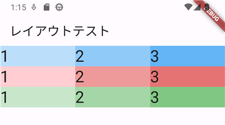

# 複雑なレイアウト

## ListView

`ListView`はスクロール可能なウィジェットです。

### 最初の例

`ListView`に画面からはみ出る程度の内容を含んだサンプルです。

```dart
import 'package:flutter/material.dart';

void main() {
  runApp(const MyApp());
}

class MyApp extends StatelessWidget {
  const MyApp({Key? key}) : super(key: key);

  @override
  Widget build(BuildContext context) {
    return MaterialApp(
      title: 'Flutter Demo',
      theme: ThemeData(
        primarySwatch: Colors.blue,
      ),
      home: const LayoutTest(),
    );
  }
}

class LayoutTest extends StatelessWidget {
  const LayoutTest({Key? key}) : super(key: key);

  @override
  Widget build(BuildContext context) {
    return Scaffold(
      appBar: AppBar(
        title: const Text('レイアウトテスト'),
      ),
      body: ListView(
        children: [
          for (var i = 1; i <= 20; i++)
            Container(
              padding: const EdgeInsets.all(20.0),
              child: Text('List$i'),
            )
        ],
      ),
    );
  }
}
```

`ListView`の主なコンストラクタ引数は次のとおりです。

| 引数 | 型 | 説明 |
|-|-|-|
| `children` | `<Widget>[]` | リストに含めるウィジェット |

### 表示件数が不明の場合

表示する件数が事前にw駆らないような場合には`ListView.builder`を使います。

```dart
body: ListView.builder(
  itemBuilder: (context, index) {
    return Container(
      decoration: const BoxDecoration(
        border: Border(
          bottom: BorderSide(
            width: 1.0,
            color: Colors.grey,
          ),
        ),
      ),
      child: Text('$index番目'),
    );
  },
),
```

この例では、無限にリストを作成しています。特にリストの項目が多い場合に、すべてのウィジェットを最初に作ってしまうと、メモリ等の資源を使ってしまいますし、時間もかかってしまいます。

`ListView.builder`では表示される部分のウィジェットを用意しますので、効率よくリストを扱うことができます。

## Table

`Table`は`HTML`の`<table>`タグと同じような構造になっています。

| HTML | Flutter |
|-|-|
| `<table>` | `Table` |
| `<tr>` | `TableRow` |
| `<td>` | `TableCell` |

最初に、3行3列の例を確認します。わかりやすいように、各セルに背景色をつけています。

```dart
import 'package:flutter/material.dart';

void main() {
  runApp(const MyApp());
}

class MyApp extends StatelessWidget {
  const MyApp({Key? key}) : super(key: key);

  @override
  Widget build(BuildContext context) {
    return MaterialApp(
      title: 'Flutter Demo',
      theme: ThemeData(
        primarySwatch: Colors.blue,
      ),
      home: const LayoutTest(),
    );
  }
}

class LayoutTest extends StatelessWidget {
  const LayoutTest({Key? key}) : super(key: key);

  @override
  Widget build(BuildContext context) {
    return Scaffold(
      appBar: AppBar(
        title: const Text('レイアウトテスト'),
      ),
      body: Table(
        children: [
          TableRow(
            children: [
              TableCell(
                child: Container(
                  decoration: BoxDecoration(
                    color: Colors.blue[100],
                  ),
                  child: Text(
                    '1',
                    style: Theme.of(context).textTheme.headline4,
                  ),
                ),
              ),
              TableCell(
                child: Container(
                  decoration: BoxDecoration(
                    color: Colors.blue[200],
                  ),
                  child: Text(
                    '2',
                    style: Theme.of(context).textTheme.headline4,
                  ),
                ),
              ),
              TableCell(
                child: Container(
                  decoration: BoxDecoration(
                    color: Colors.blue[300],
                  ),
                  child: Text(
                    '3',
                    style: Theme.of(context).textTheme.headline4,
                  ),
                ),
              ),
            ],
          ),
          TableRow(
            children: [
              TableCell(
                child: Container(
                  decoration: BoxDecoration(
                    color: Colors.red[100],
                  ),
                  child: Text(
                    '1',
                    style: Theme.of(context).textTheme.headline4,
                  ),
                ),
              ),
              TableCell(
                child: Container(
                  decoration: BoxDecoration(
                    color: Colors.red[200],
                  ),
                  child: Text(
                    '2',
                    style: Theme.of(context).textTheme.headline4,
                  ),
                ),
              ),
              TableCell(
                child: Container(
                  decoration: BoxDecoration(
                    color: Colors.red[300],
                  ),
                  child: Text(
                    '3',
                    style: Theme.of(context).textTheme.headline4,
                  ),
                ),
              ),
            ],
          ),
          TableRow(
            children: [
              TableCell(
                child: Container(
                  decoration: BoxDecoration(
                    color: Colors.green[100],
                  ),
                  child: Text(
                    '1',
                    style: Theme.of(context).textTheme.headline4,
                  ),
                ),
              ),
              TableCell(
                child: Container(
                  decoration: BoxDecoration(
                    color: Colors.green[200],
                  ),
                  child: Text(
                    '2',
                    style: Theme.of(context).textTheme.headline4,
                  ),
                ),
              ),
              TableCell(
                child: Container(
                  decoration: BoxDecoration(
                    color: Colors.green[300],
                  ),
                  child: Text(
                    '3',
                    style: Theme.of(context).textTheme.headline4,
                  ),
                ),
              ),
            ],
          ),
        ],
      ),
    );
  }
}
```

実行すると次のようになります。



実行結果の通り、`TableCell`を1行に3つ置くと、3等分されて配置されます。
