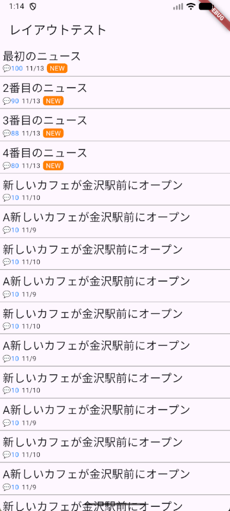

# 複雑なレイアウト

## ListView

`ListView`は同じ種類のデータを並べて、スクロール可能なウィジェットです。

### 最初の例

`ListView`に画面からはみ出る程度の内容を含んだサンプルです。

``` dart linenums="1"
import 'package:flutter/material.dart';

void main() {
  runApp(const MyApp());
}

class MyApp extends StatelessWidget {
  const MyApp({Key? key}) : super(key: key);

  @override
  Widget build(BuildContext context) {
    return MaterialApp(
      title: 'Flutter Demo',
      theme: ThemeData(
        colorScheme: ColorScheme.fromSeed(seedColor: Colors.deepPurple),
        useMaterial3: true,
      ),
      home: const LayoutTest(),
    );
  }
}

class LayoutTest extends StatelessWidget {
  const LayoutTest({Key? key}) : super(key: key);

  @override
  Widget build(BuildContext context) {
    return Scaffold(
      appBar: AppBar(
        title: const Text('レイアウトテスト'),
      ),
      body: ListView(
        children: [
          for (var i = 1; i <= 20; i++)
            Container(
              padding: const EdgeInsets.all(20.0),
              child: Text('List$i'),
            )
        ],
      ),
    );
  }
}
```

`ListView`の主なコンストラクタ引数は次のとおりです。

| 引数 | 型 | 説明 |
|-|-|-|
| `children` | `<Widget>[]` | リストに含めるウィジェット |

このパターンは、事前に表示件数がわかっている場合にのみ使えます。また、件数がわかっていても、多すぎる場合には次の、表示件数が不明の場合の方を使ったほうがいいです。

このパターンの場合、`children`に指定されているウィジェットがすべて作成されます。そのため、ウィジェットの数が多い場合にメモリをたくさん使用するおそれがあります。

次の`ListView.builder`コンストラクタを使用すると、画面に表示する必要があるウィジェットだけ作成されるので、効率的です。また、表示範囲外になったウィジェットは破棄されます。

### 表示件数が不明の場合

表示する件数が事前にわからないような場合には`ListView.builder`を使います。次の例は無限にリストを作成しています。

``` dart linenums="1"
import 'package:flutter/material.dart';

void main() {
  runApp(const MyApp());
}

class MyApp extends StatelessWidget {
  const MyApp({Key? key}) : super(key: key);

  @override
  Widget build(BuildContext context) {
    return MaterialApp(
      title: 'Flutter Demo',
      theme: ThemeData(
        colorScheme: ColorScheme.fromSeed(seedColor: Colors.deepPurple),
        useMaterial3: true,
      ),
      home: const LayoutTest(),
    );
  }
}

class LayoutTest extends StatelessWidget {
  const LayoutTest({Key? key}) : super(key: key);

  @override
  Widget build(BuildContext context) {
    return Scaffold(
      appBar: AppBar(
        title: const Text('レイアウトテスト'),
      ),
      body: ListView.builder(
        itemBuilder: (context, index) {
          return Container(
            decoration: const BoxDecoration(
              border: Border(
                bottom: BorderSide(
                  width: 1.0,
                  color: Colors.grey,
                ),
              ),
            ),
            child: Text('$index番目'),
          );
        },
      ),
    );
  }
}
```

この例では、無限にリストを作成しています。特にリストの項目が多い場合に、すべてのウィジェットを最初に作ってしまうと、メモリ等の資源を使ってしまいますし、時間もかかってしまいます。

`ListView.builder`では表示される部分のウィジェットを用意しますので、効率よくリストを扱うことができます。

### 練習問題1

次のレイアウトになるように画面を作成すること。



1行ごとのデータは次のようなクラスを作成すること

``` dart linenums="1"

class News {
  final String title;
  final DateTime date;
  final int commentCount;

  const News({
    required this.title,
    required this.date,
    required this.commentCount,
  });
}
```

このクラスに次のデータを入れて利用すること。

``` dart linenums="1"
final newsList = <News>[
  News(title: '最初のニュース', date: DateTime.now(), commentCount: 100),
  News(title: '2番目のニュース', date: DateTime.now(), commentCount: 90),
  News(title: '3番目のニュース', date: DateTime.now(), commentCount: 88),
  News(title: '4番目のニュース', date: DateTime.now(), commentCount: 80),
  News(
    title: '新しいカフェが金沢駅前にオープン',
    date: DateTime(2025, 11, 10),
    commentCount: 10,
  ),
  News(
    title: 'A新しいカフェが金沢駅前にオープン',
    date: DateTime(2025, 11, 9),
    commentCount: 10,
  ),
  News(
    title: '新しいカフェが金沢駅前にオープン',
    date: DateTime(2025, 11, 10),
    commentCount: 10,
  ),
  News(
    title: 'A新しいカフェが金沢駅前にオープン',
    date: DateTime(2025, 11, 9),
    commentCount: 10,
  ),
  News(
    title: '新しいカフェが金沢駅前にオープン',
    date: DateTime(2025, 11, 10),
    commentCount: 10,
  ),
  News(
    title: 'A新しいカフェが金沢駅前にオープン',
    date: DateTime(2025, 11, 9),
    commentCount: 10,
  ),
  News(
    title: '新しいカフェが金沢駅前にオープン',
    date: DateTime(2025, 11, 10),
    commentCount: 10,
  ),
  News(
    title: 'A新しいカフェが金沢駅前にオープン',
    date: DateTime(2025, 11, 9),
    commentCount: 10,
  ),
  News(
    title: '新しいカフェが金沢駅前にオープン',
    date: DateTime(2025, 11, 10),
    commentCount: 10,
  ),
  News(
    title: 'A新しいカフェが金沢駅前にオープン',
    date: DateTime(2025, 11, 9),
    commentCount: 10,
  ),
  News(
    title: '新しいカフェが金沢駅前にオープン',
    date: DateTime(2025, 11, 10),
    commentCount: 10,
  ),
  News(
    title: 'A新しいカフェが金沢駅前にオープン',
    date: DateTime(2025, 11, 9),
    commentCount: 10,
  ),
  News(
    title: 'B新しいカフェが金沢駅前にオープン',
    date: DateTime(2025, 11, 8),
    commentCount: 10,
  ),
  News(
    title: 'C新しいカフェが金沢駅前にオープン',
    date: DateTime(2025, 11, 7),
    commentCount: 10,
  ),
  News(
    title: 'D新しいカフェが金沢駅前にオープン',
    date: DateTime(2025, 11, 6),
    commentCount: 10,
  ),
  News(
    title: 'E新しいカフェが金沢駅前にオープン',
    date: DateTime(2025, 11, 5),
    commentCount: 10,
  ),
  News(
    title: 'F新しいカフェが金沢駅前にオープン',
    date: DateTime(2025, 11, 4),
    commentCount: 10,
  ),
  News(
    title: 'G新しいカフェが金沢駅前にオープン',
    date: DateTime(2025, 11, 3),
    commentCount: 10,
  ),
];
```
