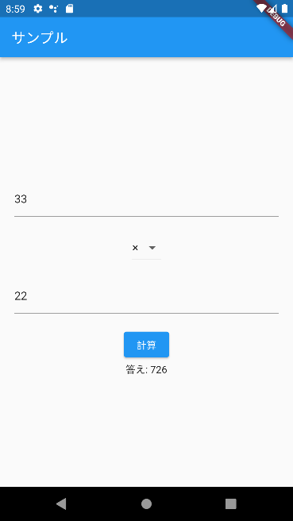

# 簡単なアプリを作る - 計算機

ここまで学習したことをもとに、かんたんな計算機を作成します。



## 画面のレイアウトの作成

```dart linenums="1"
import 'package:flutter/material.dart';

void main() {
  runApp(const MyApp());
}

class MyApp extends StatelessWidget {
  const MyApp({Key? key}) : super(key: key);

  @override
  Widget build(BuildContext context) {
    return MaterialApp(
      title: '計算機',
      theme: ThemeData(
        colorScheme: ColorScheme.fromSeed(seedColor: Colors.deepPurple),
        useMaterial3: true,
      ),
      home: const CalcWidget(),
    );
  }
}

class CalcWidget extends StatefulWidget {
  const CalcWidget({Key? key}) : super(key: key);

  @override
  State<CalcWidget> createState() => _CalcState();
}

class _CalcState extends State<CalcWidget> {
  final _num1Controller = TextEditingController();
  final _num2Controller = TextEditingController();
  String? _selectedOperator = '+';

  @override
  Widget build(BuildContext context) {
    return Scaffold(
      appBar: AppBar(
        title: const Text('サンプル'),
      ),
      body: Center(
        child: Column(
          mainAxisAlignment: MainAxisAlignment.center,
          children: [
            Container(
              padding: const EdgeInsets.all(20.0),
              child: TextField(
                controller: _num1Controller,
                keyboardType: TextInputType.number,
              ),
            ),
            DropdownButton(
              items: const [
                DropdownMenuItem(
                  value: '+',
                  child: Text('＋'),
                ),
                DropdownMenuItem(
                  value: '-',
                  child: Text('－'),
                ),
                DropdownMenuItem(
                  value: '*',
                  child: Text('×'),
                ),
                DropdownMenuItem(
                  value: '/',
                  child: Text('÷'),
                ),
              ],
              onChanged: (String? value) {
                setState(() {
                  _selectedOperator = value;
                });
              },
              value: _selectedOperator,
            ),
            Container(
              padding: const EdgeInsets.all(20.0),
              child: TextField(
                controller: _num2Controller,
                keyboardType: TextInputType.number,
              ),
            ),
            ElevatedButton(
              onPressed: () {},
              child: const Text('計算'),
            ),
            const Text('答え: '),
          ],
        ),
      ),
    );
  }
}
```

## テキストフィールドの値の取得

次に計算ボタンを押したときに、テキストフィールドの値を取得してみます。

テキストフィールドからは、`controller`を経由して値の取得ができます。文字列として取得できるので、`int.parse`メソッドで`int`型に変換します。その際、`int`型に変換できない場合`FormatException`という例外が発生するので、`try〜catch`で囲んでいます。

```dart linenums="1"
void _calc() {
  try {
    var num1 = int.parse(_num1Controller.text);
    var num2 = int.parse(_num2Controller.text);
  } catch (e) {}
}
```

また、++"計算"++ボタンの`onPressed`を押したときに`calc`メソッドが動作するようにします。

```dart linenums="1"
ElevatedButton(
  onPressed: _calc,
  child: const Text('計算'),
),
```

### 足し算だけしてみる

++"計算"++ボタンを押したときに2つの数字を足した結果を表示してみます。

まずは、結果を表示するためのフィールドを用意します。


```dart linenums="1"
var _result = '数値を入力して計算ボタンを押してください';
```

この変数は、`Text`で使用します。（`const`は削除します`）

```dart linenums="1"
Text('答え: $_result')
```

最後に、++"計算"++ボタンを押したときに動作する`calc`メソッドを変更します。状態を変更するので、`setState`を使用します。例外が発生した場合には、答えの代わりにエラーメッセージを出します。

```dart linenums="1"
void _calc() {
  setState(() {
    try {
      var num1 = int.parse(_num1Controller.text);
      var num2 = int.parse(_num2Controller.text);
      _result = (num1 + num2).toString();
    } catch (e) {
      _result = '計算できません';
    }
  });
}
```

## ドロップダウンリストに応じた計算をする

ドロップダウンリストの値によって、計算方法を選択し計算する`operatorCalc`を作成します。

```dart linenums="1"
int _operatorCalc(String? operator, int num1, int num2) {
  // nullにはならない？
  if (operator == null || operator == '+') {
    return num1 + num2;
  } else if (operator == '-') {
    return num1 - num2;
  } else if (operator == '*') {
    return num1 * num2;
  }
  return num1 ~/ num2;
}
```

`calc`メソッドの計算部分をこのメソッドに置き換えます。

```dart linenums="1"
var num1 = int.parse(num1Controller.text);
var num2 = int.parse(num2Controller.text);
_result = _operatorCalc(_selectedOperator, num1, num2).toString();
```

完成品は次のものになります。

```dart
import 'package:flutter/material.dart';

void main() {
  runApp(const MyApp());
}

class MyApp extends StatelessWidget {
  const MyApp({Key? key}) : super(key: key);

  @override
  Widget build(BuildContext context) {
    return MaterialApp(
      title: '計算機',
      theme: ThemeData(
        colorScheme: ColorScheme.fromSeed(seedColor: Colors.deepPurple),
        useMaterial3: true,
      ),
      home: const CalcWidget(),
    );
  }
}

class CalcWidget extends StatefulWidget {
  const CalcWidget({Key? key}) : super(key: key);

  @override
  State<CalcWidget> createState() => _CalcState();
}

class _CalcState extends State<CalcWidget> {
  final _num1Controller = TextEditingController();
  final _num2Controller = TextEditingController();
  String? _selectedOperator = '+';
  var _result = '数値を入力して計算ボタンを押してください';

  void _calc() {
    setState(() {
      try {
        var num1 = int.parse(_num1Controller.text);
        var num2 = int.parse(_num2Controller.text);
        _result = _operatorCalc(_selectedOperator, num1, num2).toString();
      } catch (e) {
        _result = '計算できません';
      }
    });
  }

  int _operatorCalc(String? operator, int num1, int num2) {
    // nullにはならない？
    if (operator == null || operator == '+') {
      return num1 + num2;
    } else if (operator == '-') {
      return num1 - num2;
    } else if (operator == '*') {
      return num1 * num2;
    }
    return num1 ~/ num2;
  }

  @override
  Widget build(BuildContext context) {
    return Scaffold(
      appBar: AppBar(
        title: const Text('サンプル'),
      ),
      body: Center(
        child: Column(
          mainAxisAlignment: MainAxisAlignment.center,
          children: [
            Container(
              padding: const EdgeInsets.all(20.0),
              child: TextField(
                controller: _num1Controller,
                keyboardType: TextInputType.number,
              ),
            ),
            DropdownButton(
              items: const [
                DropdownMenuItem(
                  value: '+',
                  child: Text('＋'),
                ),
                DropdownMenuItem(
                  value: '-',
                  child: Text('－'),
                ),
                DropdownMenuItem(
                  value: '*',
                  child: Text('×'),
                ),
                DropdownMenuItem(
                  value: '/',
                  child: Text('÷'),
                ),
              ],
              onChanged: (String? value) {
                setState(() {
                  _selectedOperator = value;
                });
              },
              value: _selectedOperator,
            ),
            Container(
              padding: const EdgeInsets.all(20.0),
              child: TextField(
                controller: _num2Controller,
                keyboardType: TextInputType.number,
              ),
            ),
            ElevatedButton(
              onPressed: _calc,
              child: const Text('計算'),
            ),
            Text('答え: $_result'),
          ],
        ),
      ),
    );
  }
}
```
