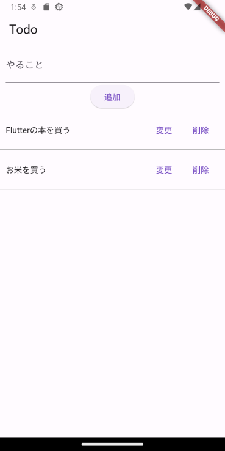
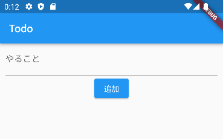
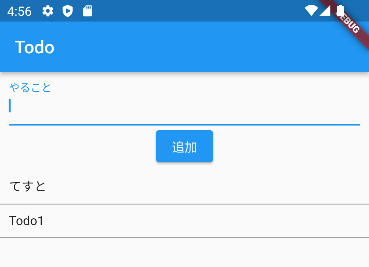
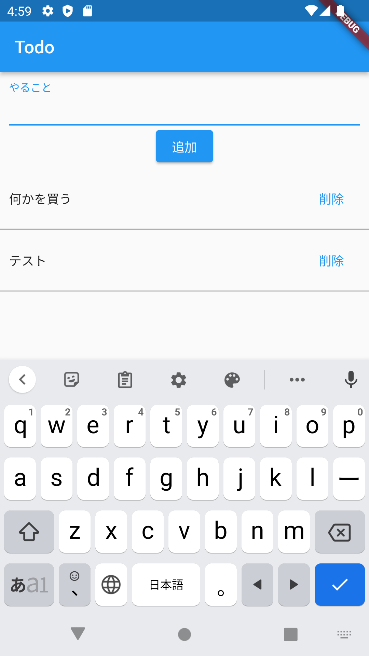
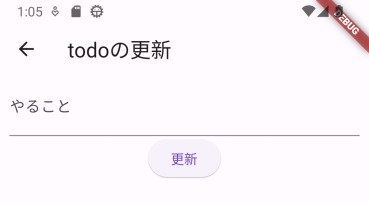

# TODOアプリ

次のようなTODOアプリを作成します。



## 入力欄を作成

最初に、TODOを入力するテキストフィールドまで作成します。`const`関連の警告が出ますが、後でまとめて対応するためスルーします。



```dart
import 'package:flutter/material.dart';

void main() {
  runApp(const MyApp());
}

class MyApp extends StatelessWidget {
  const MyApp({Key? key}) : super(key: key);

  @override
  Widget build(BuildContext context) {
    return MaterialApp(
      title: 'Flutter Demo',
      theme: ThemeData(
        primarySwatch: Colors.blue,
      ),
      home: const TodoPage(title: 'Todo'),
    );
  }
}

class TodoPage extends StatefulWidget {
  const TodoPage({Key? key, required this.title}) : super(key: key);

  final String title;

  @override
  State<TodoPage> createState() => _TodoPageState();
}

class _TodoPageState extends State<TodoPage> {
  @override
  Widget build(BuildContext context) {
    return Scaffold(
      appBar: AppBar(
        title: Text(widget.title),
      ),
      body: Column(
        children: [
          Padding(
            padding: const EdgeInsets.only(
              left: 10.0,
              right: 10.0,
            ),
            child: TextField(
              decoration: const InputDecoration(labelText: 'やること'),
            ),
          ),
          ElevatedButton(
            onPressed: () {},
            child: const Text('追加'),
          ),
        ],
      ),
    );
  }
}
```

## TODOを表示するListView

次に、TODOを表示するための`ListView`を用意します。また、`ListView`に表示するための`List`として`todos`を用意します。

画面は変わりません。

まず、フィールドとして`_TodoPageState`クラスに次のものを追加します。

```dart
var todos = [];
```

次に、++"追加"++ボタンのあとに、`ListView`を追加します。

```dart
Expanded(
  flex: 1,
  child: ListView.builder(
    itemBuilder: (context, index) {
      return Container(
          decoration: const BoxDecoration(
            border: Border(
              bottom: BorderSide(
                width: 1.0,
                color: Colors.grey,
              ),
            ),
          ),
          child: Container(
            padding: const EdgeInsets.all(10.0),
            child: Row(
              children: [
                Expanded(
                  flex: 1,
                  child: Text(todos[index]),
                ),
              ],
            ),
          ));
    },
    itemCount: todos.length,
  ),
),
```

## 追加ボタンで追加できるようにする

++"追加"++ボタンを押したときにTODOを追加できるようにします。



最初に、`TextField`の値を取得するために、`ElevatedButton`の引数の`controller`を設定します。合わせて、フィールドにコントローラを追加します。

```dart title="フィールドに追加"
var textController = TextEditingController();
```

```dart title="TextFieldに追加"
controller: textController,
```

```dart
void addTodo() {
  var text = textController.text;
  if (text.isEmpty) {
    return;
  }
  setState(() {
    textController.clear();
    todos.insert(0, text);
  });
}
```

```dart title="ElevatedButtonのonPressedに追加"
onPressed: addTodo,
```

## 削除できるようにする

追加はできたので、追加したものが削除できるようにします。行ごとに++"削除"++ボタンを作ります。



TODOを削除するためのメソッド`deleteTodo`を最初に作ります。

```dart
void deleteTodo(int index) {
  setState(() {
    todos.removeAt(index);
  });
}
```

次に、++"削除"++ボタンを作成します。

```dart
TextButton(
  onPressed: () => deleteTodo(index),
  child: const Text('削除'),
),
```

## 変更画面への切り替え

変更は、++"変更"++ボタンを押したら画面が切り替わり、そこで変更するようにします。

まずは、次のような変更画面を作成します。



```dart
class TodoUpdatePage extends StatelessWidget {
  const TodoUpdatePage({Key? key}) : super(key: key);

  void updateTodo(BuildContext context) {
    Navigator.pop(context);
  }

  @override
  Widget build(BuildContext context) {
    return Scaffold(
      appBar: AppBar(
        title: const Text('todoの更新'),
      ),
      body: Column(
        children: [
          const Padding(
            padding: EdgeInsets.only(
              left: 10.0,
              right: 10.0,
            ),
            child: TextField(
              decoration: InputDecoration(labelText: 'やること'),
            ),
          ),
          ElevatedButton(
            onPressed: () => updateTodo(context),
            child: const Text('更新'),
          ),
        ],
      ),
    );
  }
}
```

次に画面の++"変更"++ボタンを押したときに画面が切り替わるようにします。

まずは、画面の切り替え用のメソッドを追加します。

```dart
void updateTodo(BuildContext context) {
  Navigator.push(
    context,
    MaterialPageRoute(
      builder: (context) => TodoUpdatePage(),
    ),
  );
}
```

次に、++"削除"++ボタン前に++"変更"++ボタンを付けます。

```dart
TextButton(
  onPressed: () => updateTodo(context),
  child: const Text('変更'),
),
```

ここまでで画面が切り替わるようになります。

## 変更画面に選んだTODOを表示する

画面の切り替えができたので、変更画面を表示する際に、選択されたTODOを表示されるようにします。

まず、`TodoUpdatePage`のフィールドに追加します。

```dart
final TextEditingController textController = TextEditingController();
```

次に`TodoUpdatePage`のコンストラクタを次のものにします。

```dart
TodoUpdatePage({Key? key, required String todo}) : super(key: key) {
  textController.text = todo;
}
```

最後に、`TextField`に`controller`を追加します。

```dart
controller: textController,
```

`_TodoPageState`の`updataTodo`を次のようにします。

```dart
void updateTodo(BuildContext context, int index) {
  Navigator.push(
    context,
    MaterialPageRoute(
      builder: (context) => TodoUpdatePage(
        todo: todos[index],
      ),
    ),
  );
}
```

また、++"変更"++ボタンの`onPressed`を次のようにします。

```dart
onPressed: () => updateTodo(context, index),
```

## 変更できるようにする

```dart
Future<void> updateTodo(BuildContext context, int index) async {
  var result = await Navigator.push(
    context,
    MaterialPageRoute(
      builder: (context) => TodoUpdatePage(
        todo: todos[index],
      ),
    ),
  );
  if (result == null) return;
  setState(() {
    todos[index] = result;
  });
}
```

```dart
void updateTodo(BuildContext context) {
  Navigator.pop(context, textController.text);
}
```

```dart title="ElevatedButtonに追加"
void updateTodo(BuildContext context) {
  Navigator.pop(context);
}
```
