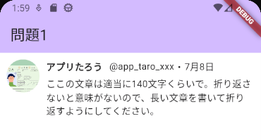
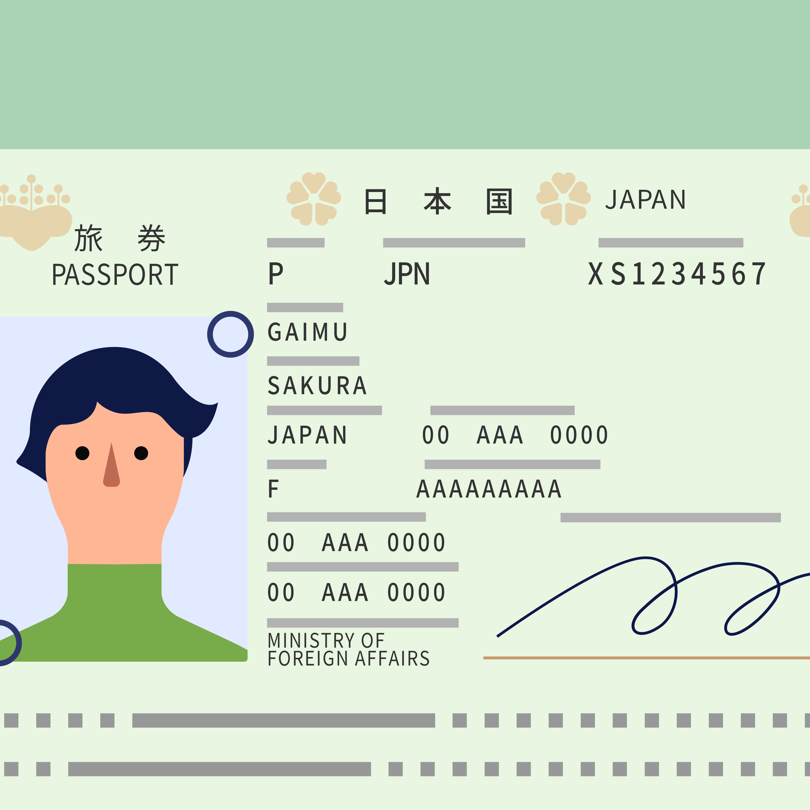
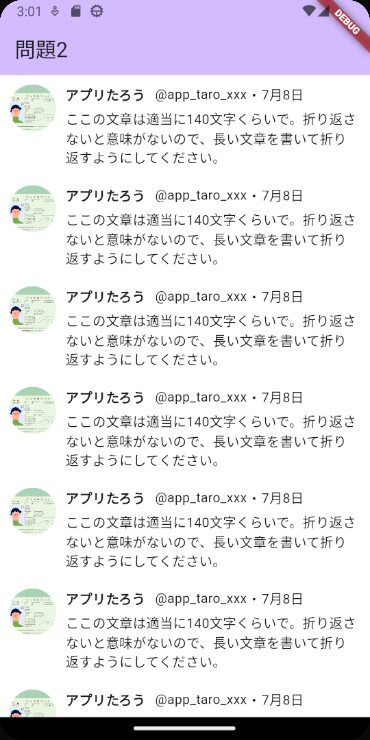

# ファイルを分けてアプリを作成する（TODO）

## 初期画面部分を別ファイルにする

初期表示される画面を`view`フォルダ内に、`todo_page.dart`ファイルとして作成します。画面の定義だけで、ボタン等は動きません。最初に作ったものと違い、TODOの追加はFloatingActionButtonを使います。

``` dart linenums="1" title="view/todo_page.dart"
import 'package:flutter/material.dart';

class TodoPage extends StatefulWidget {
  const TodoPage({super.key});

  @override
  State<TodoPage> createState() => _TodoPageState();
}

class _TodoPageState extends State<TodoPage> {
  final _todos = [];

  @override
  Widget build(BuildContext context) {
    return Scaffold(
      appBar: AppBar(title: Text('TODO')),
      body: Column(
        children: [
          Expanded(
            flex: 1,
            child: ListView.builder(
              itemBuilder: (context, index) {
                return Container(
                  decoration: BoxDecoration(
                    border: Border(
                      bottom: BorderSide(width: 1.0, color: Colors.grey),
                    ),
                  ),
                  child: Container(
                    padding: EdgeInsets.all(10.0),
                    child: Row(
                      children: [
                        Expanded(flex: 1, child: Text(_todos[index])),
                        TextButton(onPressed: () {}, child: Text('変更')),
                        TextButton(onPressed: () {}, child: Text('削除')),
                      ],
                    ),
                  ),
                );
              },
              itemCount: _todos.length,
            ),
          ),
        ],
      ),
      floatingActionButton: FloatingActionButton(
        onPressed: () {},
        child: Icon(Icons.add),
      ),
    );
  }
}
```

初期画面を表示するために、`main.dart`を次のようにします。

``` dart linenums="1" title="main.dart"
import 'package:flutter/material.dart';
import 'view/todo_page.dart';

void main() {
  runApp(const MyApp());
}

class MyApp extends StatelessWidget {
  const MyApp({super.key});

  @override
  Widget build(BuildContext context) {
    return MaterialApp(
      title: 'Flutter Demo',
      theme: ThemeData(
        colorScheme: ColorScheme.fromSeed(seedColor: Colors.deepPurple),
        useMaterial3: true,
      ),
      home: const TodoPage(),
    );
  }
}
```

ファイルを分割した場合、そのファイルで定義されたクラス等を使いたい場合には、`import`を書きます。`import`は取り込みたいファイルの相対パスを記載します。

## 追加できるようにする

最初にTODOを追加できるようにします。まず、`TodoPageState`クラスに次のメソッドを追加します。

```dart linenums="1" title="view/todo_page.dart"
void _showAddDialog() async {
  final textController = TextEditingController();
  var result = await showDialog<String>(
    context: context,
    builder: (_) {
      return AlertDialog(
        title: Text('TODOの追加'),
        content: Padding(
          padding: EdgeInsets.only(left: 10.0, right: 10.0),
          child: TextField(
            controller: textController,
            decoration: InputDecoration(labelText: 'やること'),
          ),
        ),
        actions: [
          TextButton(
            child: Text('キャンセル'),
            onPressed: () => Navigator.pop(context, null),
          ),
          TextButton(
            child: Text('登録'),
            onPressed: () => Navigator.pop(context, textController.text),
          ),
        ],
      );
    },
  );
  if (result != null && result.isNotEmpty) {
    setState(() {
      _todos.insert(0, result);
    });
  }
}
```

また、`FloatingActionButton`を押したときに、このメソッドが呼び出される夜にします。

``` dart linenums="1"
onPressed: _showAddDialog,
```

## 削除できるようにする

`deleteTodo`メソッドを追加します。

``` dart linenums="1"
void _deleteTodo(int index) async {
  var result = await showDialog<bool>(
    context: context,
    builder: (_) {
      return AlertDialog(
        title: Text('TODOの削除'),
        content: Text('「${_todos[index]}」を削除してよろしいですか'),
        actions: [
          TextButton(
            child: Text('いいえ'),
            onPressed: () => Navigator.pop(context, false),
          ),
          TextButton(
            child: Text('はい'),
            onPressed: () => Navigator.pop(context, true),
          ),
        ],
      );
    },
  );
  if (result != null && result) {
    setState(() {
      _todos.removeAt(index);
    });
  }
}
```

また、削除ボタンで、`deleteTodo`メソッドが呼び出されるようにします。

``` dart linenums="1"
onPressed: () => _deleteTodo(index),
```

## 更新できるようにする

更新画面は別の画面に表示するので、`view`フォルダ内に、`todo_update_page.dart`ファイルを作成します。

``` dart linenums="1"
import 'package:flutter/material.dart';

class TodoUpdatePage extends StatelessWidget {
  TodoUpdatePage({super.key, required String todo}) {
    _textController.text = todo;
  }

  final TextEditingController _textController = TextEditingController();

  void updateTodo(BuildContext context) {
    Navigator.pop<String>(context, _textController.text);
  }

  @override
  Widget build(BuildContext context) {
    return Scaffold(
      appBar: AppBar(title: Text('todoの更新')),
      body: Column(
        children: [
          Padding(
            padding: EdgeInsets.only(left: 10.0, right: 10.0),
            child: TextField(
              controller: _textController,
              decoration: InputDecoration(labelText: 'やること'),
            ),
          ),
          ElevatedButton(
            onPressed: () => updateTodo(context),
            child: Text('更新'),
          ),
        ],
      ),
    );
  }
}
```

`todo_page.dart`に次の`import`を追加します。

``` dart linenums="1"
import 'todo_update_page.dart';
```

`updateTodo`メソッドを追加します。

``` dart linenums="1"
void _updateTodo(BuildContext context, int index) async {
  var result = await Navigator.push<String>(
    context,
    MaterialPageRoute(
      builder: (context) => TodoUpdatePage(todo: _todos[index]),
    ),
  );
  if (result == null) return;
  setState(() {
    _todos[index] = result;
  });
}
```

変更ボタンにメソッドを設定します。

```dart
onPressed: () => _updateTodo(context, index),
```

## 練習問題

### 問題1

次のようなアプリを作成すること。

<video src="image/01.mp4" width="372" controls></video>

### 問題2

次の画面レイアウトになるように画面を作成すること。



画像は、次の画像をダウンロードし、プロジェクトフォルダの中に`assets`フォルダを作りそこに入れること。



また、`pubspec.yaml`ファイルの54行目付近に次を追加すること。

```yaml
flutter:
  assets:
    - assets/s_06.png
```

画像を丸く表示するには、次のようにします。

```dart
Container(
  width: 50.0,
  height: 50.0,
  decoration: BoxDecoration(
    shape: BoxShape.circle,
    image: DecorationImage(
      fit: BoxFit.fill,
      image: AssetImage('assets/s_06.png'),
    ),
  ),
),
```

### 問題3

次の画面レイアウトになるように画面を作成すること。


